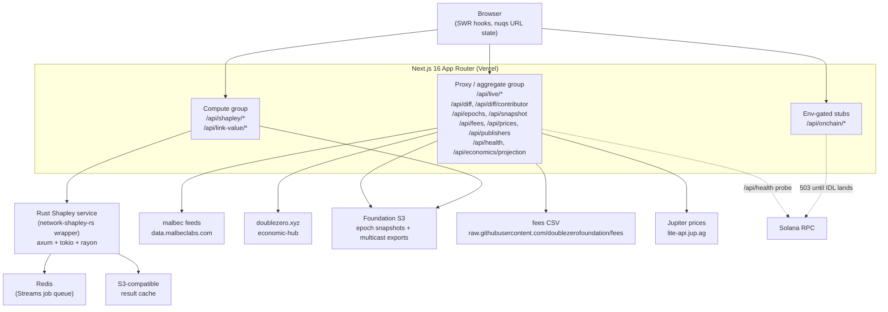
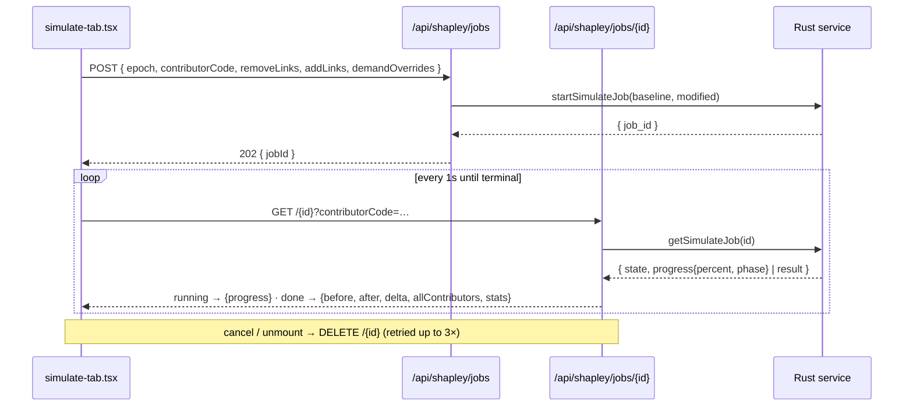
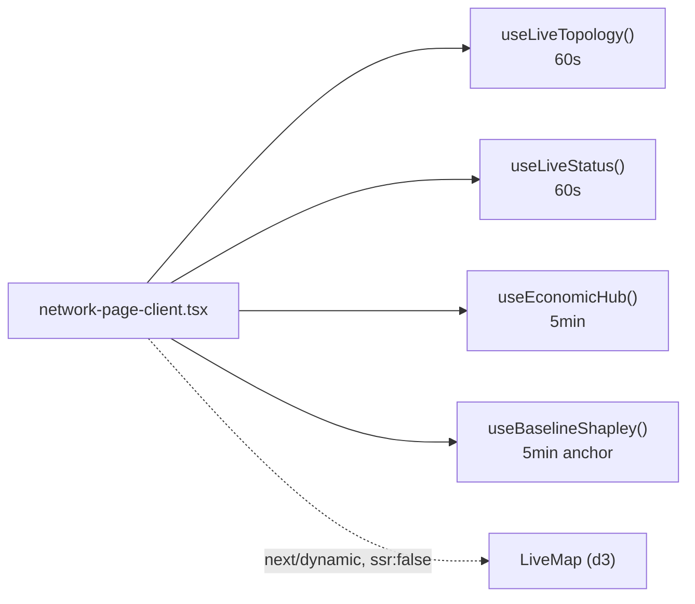
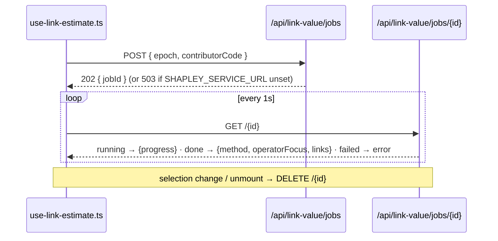

# Architecture

DZ Contributor Rewards is a Next.js 16 App Router frontend (deployed on Vercel) that proxies six external data feeds and a Rust Shapley microservice, presenting live DoubleZero network state, on-chain reward distribution, and a Shapley-based forecaster. The Rust service wraps the canonical [`network-shapley-rs`](https://github.com/doublezerofoundation/network-shapley-rs) LP solver (built against the rev-pinned fork [`phaselabscrypto/network-shapley-rs`](https://github.com/phaselabscrypto/network-shapley-rs) — see `services/shapley-rs/Cargo.toml`) behind an HTTP API backed by a Redis Streams job queue and an S3-compatible result cache.

This document is the index into the system. For depth, follow the cross-links:

| Doc | Covers |
|---|---|
| [README.md](../README.md) | Repo index, route table, quick start |
| architecture.md | This file — system shape, flows, caching, security summary |
| [data-sources.md](./data-sources.md) | Each upstream feed: shape, ownership, refresh |
| [shapley-pipeline.md](./shapley-pipeline.md) | Snapshot → canonical input → Shapley values pipeline |
| [shapley-service.md](./shapley-service.md) | Rust microservice: endpoints, queue, cache, auth |
| [development.md](./development.md) | Local setup, env vars, running without the Rust service |
| [operations.md](./operations.md) | Deployment, cron, rate limits, observability |
| [adr/0001-async-compute-queue.md](./adr/0001-async-compute-queue.md) | Why the long solves run as queued jobs |

## System diagram

All external feeds are reached **server-side** from the API routes — the browser only ever talks to `/api/*` on its own origin. The Content-Security-Policy in `next.config.ts` enforces this: `connect-src 'self'` in production. The on-chain group is dark by default and returns `503` with a stable shape until DoubleZero ships the program IDL (see `lib/onchain/README.md`).

## Layer tour

### Pages (`app/**/page.tsx`)

Sixteen routes, all under the sidebar shell in `app/layout.tsx`. Most pages are thin server components that render a `"use client"` page-client which mounts the SWR hooks.

| Route | Source | Purpose |
|---|---|---|
| `/` | `app/page.tsx` | Landing — links into every tool |
| `/network` | `app/network/page.tsx` | Live topology: stats, issues, metro demand, leaderboard, world map |
| `/contributors` | `app/contributors/page.tsx` | Sortable operator index |
| `/contributors/[code]` | `app/contributors/[code]/page.tsx` | Operator detail — reconciliation, changelog, history |
| `/contributors/[code]/links` | `app/contributors/[code]/links/page.tsx` | Per-link value-add breakdown |
| `/validators` | `app/validators/page.tsx` | Publishing validators — stake-weighted SOL projection |
| `/validators/calculator` | `app/validators/calculator/page.tsx` | Vote-pubkey reward calculator |
| `/links` | `app/links/page.tsx` | Sortable link table with health overlay |
| `/links/[id]` | `app/links/[id]/page.tsx` | Single-link detail |
| `/simulate` | `app/simulate/page.tsx` | Forecast tool — add/remove links, modify demand, see Shapley delta |
| `/link-value` | `app/link-value/page.tsx` | Canonical per-link value ranking |
| `/economics` | `app/economics/page.tsx` | Pool projection, Shapley tracking, share-vs-footprint |
| `/rewards` | `app/rewards/page.tsx` | Historical 2Z fee distribution per epoch |
| `/changelog` | `app/changelog/page.tsx` | Cross-epoch topology diff |
| `/status` | `app/status/page.tsx` | Source-feed health table |
| `/methodology` | `app/methodology/page.tsx` | Every formula, source, and method label documented inline |

### Components (`components/`)

Grouped by feature, plus a set of unstyled-to-styled primitives in `components/ui`.

| Group | Notable members |
|---|---|
| `components/network` | `network-page-client.tsx`, `live-map.tsx` (lazy), `metro-demand.tsx` |
| `components/simulator` | `simulate-tab.tsx`, `shapley-job-modal.tsx`, `simulator-map.tsx` |
| `components/economics` | `pool-projection.tsx`, `shapley-tracking.tsx`, `share-vs-footprint.tsx`, `live-baseline-shapley.tsx` |
| `components/contributors` | `contributor-detail.tsx`, `contributor-changelog.tsx`, `reward-reconciliation.tsx`, `onchain-reward-history.tsx` |
| `components/links` | `links-table.tsx`, `links-table-content.tsx` |
| `components/validators` | `validator-rewards.tsx` |
| top-level | `header.tsx`, `section-heading.tsx` |
| `components/ui` | `card.tsx`, `table.tsx`, `dense-table.tsx`, `dialog.tsx`, `select.tsx`, `tabs.tsx`, `badge.tsx`, `button.tsx`, `sparkline.tsx`, `network-pulse.tsx`, `sidebar-shell.tsx`, `page-header.tsx`, `states.tsx`, `keyboard-shortcuts.tsx`, `theme-toggle.tsx`, `web-vitals-reporter.tsx` |

The Shapley `method` label (see [Method labels](#method-labels)) is surfaced through `MethodBadge`, used by `components/economics/live-baseline-shapley.tsx`.

### Data hooks (`lib/hooks/`)

Client data is fetched with SWR. The shared config (`lib/hooks/use-live.ts`) sets `revalidateOnFocus: false`, `focusThrottleInterval: 300000`, and `dedupingInterval: 30000` (30 s) so a tab regaining focus does not stampede the API. Refresh cadences:

| Hook | Endpoint | Refresh interval |
|---|---|---|
| `useLiveTopology` / `useLiveStats` / `useLiveStatus` | `/api/live/{topology,stats,status}` | 60 s |
| `useEconomicHub` | `/api/live/economic-hub` | 5 min |
| `useBaselineShapley` | `/api/shapley/baseline` | 5 min |
| `usePoolProjection` | `/api/economics/projection` | 5 min |
| `useShapleyTracking` | `/api/shapley/tracking` | 30 min (5 min dedupe) |
| `useHealth` | `/api/health` | 30 s |
| `useShapleyValues` (`lib/hooks/use-shapley.ts`) | `/api/shapley?epoch=N` | on-demand (5 min dedupe) |
| `useEpochs` / `useSnapshot` (`lib/hooks/use-epochs.ts`, `use-snapshot.ts`) | `/api/epochs`, `/api/snapshot` | on-demand (5 min / 1 min dedupe) |
| `useFees` / `usePrices` / `usePublishers` / `useLinks` | `/api/{fees,prices,publishers}` | per-hook |

`useLinkEstimate` (`lib/hooks/use-link-estimate.ts`) is not SWR — it drives the async link-value job lifecycle (submit → 1 s poll → done/error), described in [flow 3c](#c-link-value-async-job).

### API routes (`app/api/**/route.ts`)

There are **29** `route.ts` files. They fall into three behavioral groups:

- **Proxy / aggregate** — fetch an upstream server-side, cache, and return JSON. Examples: `live/*`, `epochs`, `snapshot`, `fees`, `prices`, `publishers`, `economics/projection`, `health`, `diff`, `diff/contributor/[code]`.
- **Compute** — build a Shapley input and call the Rust service: `shapley`, `shapley/baseline`, `shapley/simulate`, `shapley/tracking`, `shapley/jobs` (+ `[id]`), `link-value/jobs` (+ `[id]`), `link-value/precompute`. All eight rate-limited routes live here plus the two diff routes (see [Security posture](#security-posture-summary)).
- **Env-gated stubs** — `onchain/{topology,validators}` pre-flight-check configuration and return `503` with a stable `{ ready: false, reason }` shape until `ONCHAIN_ENABLED` / `DZ_REGISTRY_PROGRAM_ID` are set; `onchain/{contributors,rewards,contributor-rewards}` attempt the read directly and surface a `502` on failure instead.
- **Meta** — `methodology` (machine-readable formula/source manifest) and `vitals` (Web Vitals sink; always `204`, logs only outside production).

### `lib/utils`

The builders, solver clients, and caches that the routes compose:

- **Input builders** — `canonical-input-builder.ts` (bit-comparable to the Foundation reference), `shapley-input-builder.ts` (heuristic fallback), `live-shapley-input.ts`, `shapley-input-modifier.ts` (applies simulate edits). `snapshot-parser.ts` + `snapshot-diff.ts` parse and diff S3 snapshots.
- **Solver clients** — `shapley-remote.ts` is the single source of truth for talking to the Rust service (compute, simulate, job start/poll/cancel, precompute sweep). `shapley-solver.ts` is the in-process TypeScript solver used only in local dev.
- **Caching + safety** — `lru-cache.ts` (TTL + size-capped LRU used by the compute routes), `rate-limit.ts` (per-instance advisory IP limiter), `sweep-tag.ts` (S3 marker key per epoch).
- **Feed helpers** — `live-topology-fetch.ts`, `economic-hub-fetch.ts`, `epoch-discovery.ts`, `fee-parser.ts`, `jupiter-price.ts`, `csv.ts`.

### `lib/onchain`

Typed Solana RPC client and Anchor-IDL decoder **stubs** awaiting the DoubleZero program IDL. `program-ids.ts` defines `SOLANA_RPC_URL` (defaults to `https://api.mainnet-beta.solana.com`), `DZ_REGISTRY_PROGRAM_ID`, `DZ_REWARDS_PROGRAM_ID`, and the `ONCHAIN_ENABLED` toggle. Until the IDL is checked in at `lib/onchain/idl/` and the registry swapped from `stubRegistry` to `anchorRegistry`, the `/api/onchain/*` routes return `503`. The activation checklist lives in `lib/onchain/README.md`.

### Rust service (`services/shapley-rs/`)

An axum + tokio + rayon HTTP wrapper around `network-shapley-rs`. It exposes `POST /shapley`, `POST /simulate`, `POST /link-estimate`, async job endpoints (`/jobs/*`), and a precompute sweep (`/precompute/link-estimates`), persisting per-`(epoch, operator)` results to an S3-compatible cache so each one is computed once. Its Dockerfile is an OpenShift-compatible image (runs as a non-root user with gid=0, `chmod g=u`). Full detail — endpoints, the Redis Streams queue, the result cache, and bearer auth — is in [shapley-service.md](./shapley-service.md); the algorithm itself is in [shapley-pipeline.md](./shapley-pipeline.md).

## Request flows

### a. `/simulate` (async what-if job)

The simulate page holds the selected contributor + epoch in the URL via `nuqs` (`app/simulate/page.tsx`), resolves the latest epoch with `useEpochs()`, and loads the snapshot with `useSnapshot(epoch)`. Edits (add/remove links, demand overrides) are local React state. On **Calculate**, `components/simulator/simulate-tab.tsx` drives the **async job API** — not the synchronous route — because a full re-solve can take minutes:

The poll runs at 1 s with a 20-consecutive-failure budget; progress carries both `percent` and a `phase` (`baseline` / `modified`). The job route maps the raw baseline/modified outputs into the same `{ before, after, delta, allContributors }` shape the synchronous route produces, so the UI renders either identically. A separate synchronous endpoint, `app/api/shapley/simulate/route.ts`, implements the one-shot path (per-epoch baseline cache → `simulateShapleyRemote` in `lib/utils/shapley-remote.ts`, falling back to a second `computeShapleyRemote` call on `/simulate` failure — **never** the TS solver); it is available programmatically but is not what the page drives.

### b. `/network` (live SWR + lazy map)

`app/network/page.tsx` is a thin server component; the work is in `components/network/network-page-client.tsx`, which mounts SWR hooks and lazy-loads the map.

`/api/shapley/baseline` is the live-network Shapley anchor: it computes Shapley values against the **current** topology rather than a historical snapshot, on a 5-minute cache (the input only changes when malbec topology refreshes every 60 s). The world map (`components/network/live-map.tsx`) is loaded via `next/dynamic` with `ssr: false` so the heavy d3 chain stays out of the initial bundle.

### c. `/link-value` (async job)

Per-link value-add is canonical-only — there is no approximate fallback. `lib/hooks/use-link-estimate.ts`:

Polling is 1 s with a 20-consecutive-failure budget (`MAX_CONSECUTIVE_POLL_FAILURES`); exhausting it cancels the job and errors hard. Cancellation (`DELETE`) is best-effort from the hook, and the Next.js proxy's service-side cancel (`cancelSimulateJob` in `lib/utils/shapley-remote.ts`) retries the idempotent Redis flag write up to **3×**. Precomputed `(epoch, operator)` pairs (warmed by the cron, [flow d](#operations--cron)) complete at submit time, so the first poll returns instantly.

## Caching matrix

Every compute/proxy route caches; the mechanism and bounds vary by route. Verified against each route file:

| Route / layer | Mechanism | TTL | Size cap |
|---|---|---|---|
| `/api/snapshot` | in-memory LRU (`lru-cache.ts`) + CDN headers | 5 min LRU; `max-age=3600, s-maxage=3600, stale-while-revalidate=86400` | 8 entries |
| `/api/epochs` | CDN headers only | `max-age=300, s-maxage=300, stale-while-revalidate=600` | — |
| `/api/shapley?epoch=N` | in-memory LRU | 30 min | 32 entries |
| `/api/shapley/baseline` | module-level cache | 5 min | 1 (singleton) |
| `/api/shapley/simulate` | module-level `Map` (per-epoch baseline) | 30 min | 10 entries |
| `/api/shapley/tracking` | in-memory LRU (keyed by `count`) | 30 min | 4 entries |
| `/api/diff` | in-memory LRU (keyed by `from→to`) | 30 min | 16 entries |
| `/api/diff/contributor/[code]` | in-memory LRU (keyed by `code:from→to`) | 30 min | 48 entries |
| `/api/live/topology` / `stats` / `status` | ISR (`export const revalidate = 60`) + 60 s module cache (topology's lives in `lib/utils/live-topology-fetch.ts`, shared with the baseline route) | 60 s | — |
| `/api/live/economic-hub` | module cache + ISR + CDN | 5 min (`max-age=300`) | 1 |
| `/api/fees` | module cache + CDN | 10 min (`max-age=600, s-maxage=600, stale-while-revalidate=1800`) | 1 |
| `/api/prices` | module cache | 60 s | 1 |
| `/api/publishers` | module cache | 5 min | 1 |
| `/api/health` | CDN headers | `max-age=15, s-maxage=15, stale-while-revalidate=60` | — |
| SWR (client) | dedupe window | 30 s | per-key |

In-memory caches are **per Vercel function instance** — a scale-out fleet holds N independent copies. Snapshots are immutable for completed epochs, which is why they (and the diff/shapley routes derived from them) can cache aggressively at every layer.

## Data ownership

Each fact has exactly one upstream owner. Detail (shapes, fallback chains) is in [data-sources.md](./data-sources.md).

| Fact | Owner | Upstream | Refresh |
|---|---|---|---|
| Live topology (devices, links, metros) | malbec | `data.malbeclabs.com/api/topology` | 60 s |
| Live network stats | malbec | `data.malbeclabs.com/api/stats` | 60 s |
| Live source/issue status | malbec | `data.malbeclabs.com/api/status` | 60 s |
| Publisher enrichment overlay | malbec | `data.malbeclabs.com/api/dz/publisher-check` | 5 min |
| Multicast validator set + `published_shreds` | DZ Foundation | `doublezero-foundation-public.s3.us-east-2…/exports/…` | 5 min |
| Distributed reward percentages (all-time) | doublezero.xyz | `doublezero.xyz/api/economic-hub` | 5 min |
| Historical per-epoch snapshots | DZ Foundation S3 | `…mn-beta-snapshots.s3.us-east-1…/mn-epoch-{N}-snapshot.json` | immutable per epoch |
| Historical 2Z fee distribution | DZ Foundation | `raw.githubusercontent.com/doublezerofoundation/fees/main/fees_and_payments_consolidated.csv` | manual (~per epoch) |
| Spot prices (2Z, SOL) | Jupiter | `lite-api.jup.ag/price/v3` | 60 s |
| Direct on-chain reads | Solana RPC | `SOLANA_RPC_URL` (default `api.mainnet-beta.solana.com`) | stubbed (`503`) |

The publisher feed treats Foundation exports as authoritative and malbec as a best-effort enrichment overlay (`app/api/publishers/route.ts`). The earliest published snapshot epoch is `MIN_DZ_EPOCH = 48` (`lib/constants/config.ts`); no upper bound is pinned — routes let the S3 `404` reject epochs that don't exist yet.

## Method labels

Every Shapley response carries a `method` field so the UI can be honest about which algorithm produced a number. The labels:

| Label | Meaning | Source |
|---|---|---|
| `lp-per-city-stake-weighted-exact` | Canonical Rust solver — what the service actually stamps on every `/shapley`, `/simulate`, and async-job result | `services/shapley-rs/src/routes.rs` |
| `lp-multi-commodity-flow-rs` | Legacy decode default on the TS side, applied only if a service response lacked `method` (never the case with the current service) | `DEFAULT_METHOD`, `lib/utils/shapley-remote.ts` |
| `local-ts-heuristic-DEV-ONLY` | In-process TS heuristic, dev only | `lib/utils/shapley-solver.ts` via the compute routes |
| `retag-shapley-rs` | Per-link value-add (faithful retag port of `network_linkestimate`) | `services/shapley-rs/src/routes.rs` |

> **Known drift:** some UI checks (`components/contributors/reward-reconciliation.tsx`, `components/economics/live-baseline-shapley.tsx`) and the `/methodology` prose still compare against `lp-multi-commodity-flow-rs`, which the current service no longer emits — those comparisons are permanently false until updated to `lp-per-city-stake-weighted-exact`.

**No-silent-fallback policy.** When `SHAPLEY_SERVICE_URL` is set, the canonical routes serve **only** Rust-solver results. If the remote call fails they return `502` rather than silently swapping in a different algorithm — masking that divergence in production would make it undetectable. This is enforced in `app/api/shapley/route.ts`, `app/api/shapley/baseline/route.ts`, and `app/api/shapley/tracking/route.ts` (which additionally reports per-epoch failures in `skippedEpochs[]`). One narrow, non-silent carve-out: `/api/shapley/baseline` answers `202 {status: "warming"}` when the latest epoch's solve was cut mid-flight by a timeout (the result isn't cached yet; the precompute cron heals it) — still no algorithm swap, still reported to observability; every other failure remains a `502` (see docs/shapley-pipeline.md). The `local-ts-heuristic-DEV-ONLY` label is emitted only when `SHAPLEY_SERVICE_URL` is **unset** entirely (local dev) — production never emits it, and stamping it loudly makes any misconfigured deployment immediately spottable. The whole system is documented for external auditors in `/methodology` (`app/methodology/page.tsx`, `app/api/methodology/route.ts`).

## Security posture (summary)

See [operations.md](./operations.md) for the operational detail; the building blocks:

**HTTP security headers** (`next.config.ts`, applied to every route): a tight Content-Security-Policy (`default-src 'self'`, `connect-src 'self'`, `frame-ancestors 'none'`, `object-src 'none'`, `upgrade-insecure-requests`; `'unsafe-eval'` dropped in production), `X-Frame-Options: DENY`, `X-Content-Type-Options: nosniff`, `Referrer-Policy: strict-origin-when-cross-origin`, `Permissions-Policy` locking off camera/microphone/geolocation, and HSTS (`max-age=63072000; includeSubDomains; preload`). `X-Powered-By` is suppressed.

**Rate limiting** (`lib/utils/rate-limit.ts`): a per-instance, in-memory, advisory IP limiter keyed on the trusted `x-real-ip` header (falling back to `x-forwarded-for` only off-Vercel). Presets:

| Preset | Limit | Used by |
|---|---|---|
| `RATE_LIMIT_HEAVY` | 10 req / min | all compute routes + both diff routes (`shapley`, `shapley/simulate`, `shapley/baseline`, `shapley/tracking`, `shapley/jobs`, `link-value/jobs`, `diff`, `diff/contributor/[code]`) |
| `RATE_LIMIT_STANDARD` | 60 req / min | (defined; not currently wired) |
| `RATE_LIMIT_LOOSE` | 120 req / min | (defined; not currently wired) |

The limiter is advisory by design — when no trusted IP can be identified the request proceeds rather than sharing one bucket across unknown callers, and the bucket map is bounded so a header-spoofing flood can't OOM the instance. It throttles pathological retries from a single client; it is not a global SLA.

**Service-to-service auth.** The Rust service uses fail-closed bearer auth — the Next.js routes attach `SHAPLEY_API_TOKEN` as `Authorization: Bearer …` (never exposed to clients); see [shapley-service.md](./shapley-service.md).

**Cron auth.** The precompute cron (`app/api/link-value/precompute/route.ts`) requires `CRON_SECRET` and verifies the `Authorization: Bearer` header with a timing-safe comparison (`crypto.timingSafeEqual`): an unset secret returns `503`, a mismatch `401`.

The `/api/health` aggregator (`app/api/health/route.ts`) is itself hardened — it returns only hostnames (never full URLs, paths, or tokens) and coarse error categories, so probing it can't leak upstream routing or credentials.

## Operations & cron

Two Vercel cron jobs (`vercel.json`):

| Path | Schedule | Purpose |
|---|---|---|
| `/api/health` | `*/15 * * * *` (every 15 min) | keep the source-health view warm |
| `/api/link-value/precompute` | `0 */6 * * *` (every 6 h) | sweep the latest epoch's per-link estimates + warm the baseline cache |

The precompute sweep checks the Rust service's "fully swept" S3 marker first (steady-state fires return in seconds without fetching the snapshot), then enqueues a single sweep job that a worker expands into per-operator link-estimate jobs. The rationale for moving these long solves onto a queue — rather than holding an HTTP socket through O(operators) round-trips — is recorded in [adr/0001-async-compute-queue.md](./adr/0001-async-compute-queue.md). Deployment, env-var setup, and observability are in [operations.md](./operations.md).
