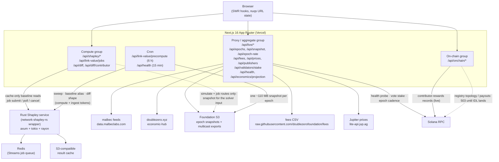
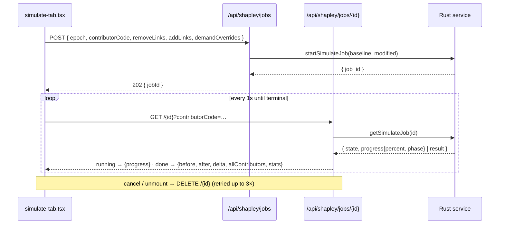
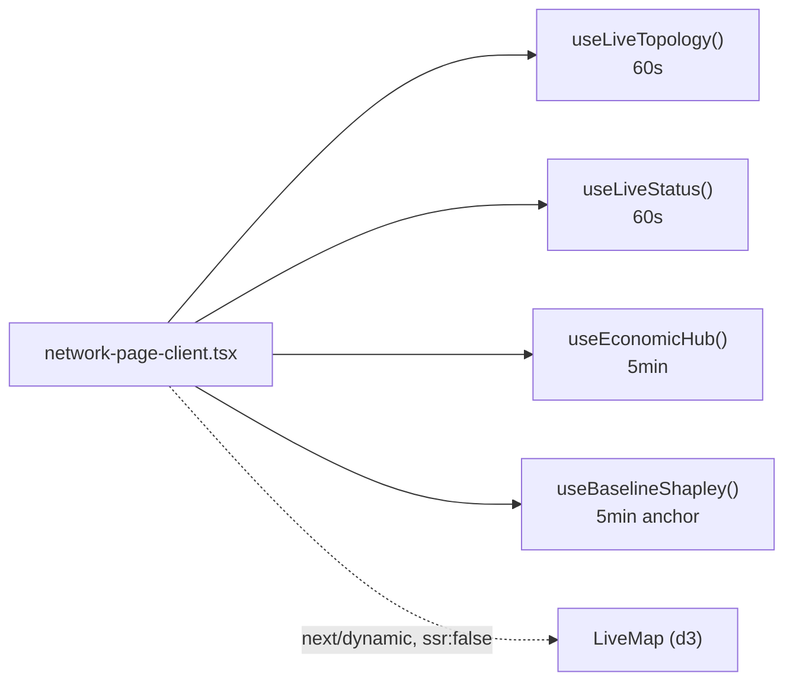
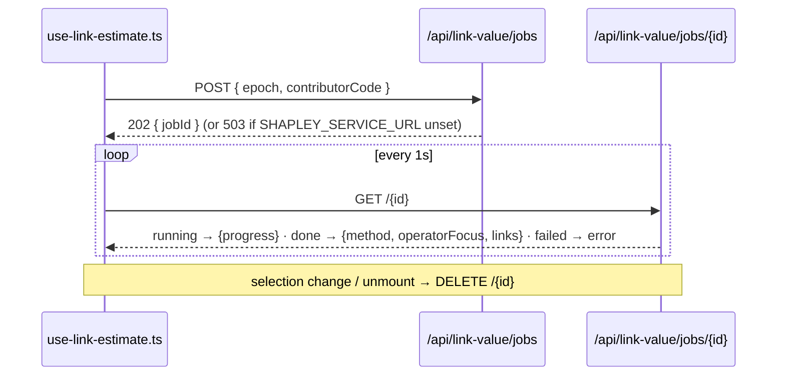

# Architecture

DZ Contributor Rewards is a Next.js 16 App Router frontend (deployed on Vercel) that proxies six external data feeds and a Rust Shapley microservice, presenting live DoubleZero network state, on-chain reward distribution, and a Shapley-based forecaster. The Rust service wraps the canonical [`network-shapley-rs`](https://github.com/doublezerofoundation/network-shapley-rs) LP solver (built against the rev-pinned fork [`phaselabscrypto/network-shapley-rs`](https://github.com/phaselabscrypto/network-shapley-rs) — see `services/shapley-rs/Cargo.toml`) behind an HTTP API backed by a Redis Streams job queue and an S3-compatible result cache.

This document is the index into the system. For depth, follow the cross-links:

| Doc | Covers |
|---|---|
| [README.md](../README.md) | Repo index, route table, quick start |
| architecture.md | This file — system shape, flows, caching, security summary |
| [data-sources.md](./data-sources.md) | Each upstream feed: shape, ownership, refresh |
| [shapley-pipeline.md](./shapley-pipeline.md) | Snapshot → canonical input → Shapley values pipeline |
| [shapley-service.md](./shapley-service.md) | Rust microservice: endpoints, queue, cache, auth |
| [development.md](./development.md) | Local setup, env vars, running without the Rust service |
| [operations.md](./operations.md) | Deployment, cron, rate limits, observability |
| [adr/0001-async-compute-queue.md](./adr/0001-async-compute-queue.md) | Why the long solves run as queued jobs |
| [adr/0002-snapshot-diff-index.md](./adr/0002-snapshot-diff-index.md) | Why the epoch diff is served from a Rust-side index |
| [adr/0003-cron-side-snapshot-extraction.md](./adr/0003-cron-side-snapshot-extraction.md) | Why the cron extracts diff shapes and the service never reads the snapshot bucket |
| [adr/0004-cache-only-baseline-reads.md](./adr/0004-cache-only-baseline-reads.md) | Why browser-driven Shapley reads never compute and are keyed by epoch tag |

## System diagram

```mermaid
flowchart TD
    browser["Browser<br/>(SWR hooks, nuqs URL state)"]

    subgraph next["Next.js 16 App Router (Vercel)"]
        direction TB
        proxy["Proxy / aggregate group<br/>/api/live/*<br/>/api/epochs, /api/snapshot, /api/epoch-rate<br/>/api/fees, /api/prices, /api/publishers<br/>/api/validators/stake<br/>/api/health, /api/economics/projection"]
        compute["Compute group<br/>/api/shapley/*<br/>/api/link-value/jobs<br/>/api/diff, /api/diff/contributor"]
        cron["Cron<br/>/api/link-value/precompute (6 h)<br/>/api/health (15 min)"]
        onchain["On-chain group<br/>/api/onchain/*"]
    end

    rust["Rust Shapley service<br/>(network-shapley-rs wrapper)<br/>axum + tokio + rayon"]
    redis["Redis<br/>(Streams job queue)"]
    s3cache["S3-compatible<br/>result cache"]

    malbec["malbec feeds<br/>data.malbeclabs.com"]
    hub["doublezero.xyz<br/>economic-hub"]
    snaps["Foundation S3<br/>epoch snapshots + multicast exports"]
    fees["fees CSV<br/>raw.githubusercontent.com/doublezerofoundation/fees"]
    jup["Jupiter prices<br/>lite-api.jup.ag"]
    rpc["Solana RPC"]

    browser --> proxy
    browser --> compute
    browser --> onchain

    proxy --> malbec
    proxy --> hub
    proxy --> snaps
    proxy --> fees
    proxy --> jup
    proxy -- "health probe · vote stake · epoch cadence" --> rpc

    compute -- "cache-only baseline reads<br/>job submit / poll / cancel" --> rust
    compute -. "simulate + job routes only:<br/>snapshot for the solver input" .-> snaps
    cron -- "one ~110 MB snapshot per epoch" --> snaps
    cron -- "sweep · baseline alias · diff shape<br/>(compute + ingest tokens)" --> rust
    onchain -- "contributor-rewards records (live)" --> rpc
    onchain -. "registry topology / payouts: 503 until IDL lands" .-> rpc

    rust --> redis
    rust --> s3cache
```

All external feeds are reached **server-side** from the API routes — the browser only ever talks to `/api/*` on its own origin. The Content-Security-Policy in `next.config.ts` enforces this: `connect-src 'self'` in production. The Rust service never reads the public snapshot bucket: the cron downloads each epoch's snapshot once and pushes the derived inputs, aliases, and diff shapes to it ([ADR 0003](./adr/0003-cron-side-snapshot-extraction.md)). Browser-driven Shapley reads never compute ([ADR 0004](./adr/0004-cache-only-baseline-reads.md)). The on-chain group reads contributor-rewards records live from the DZ ledger; its registry-topology and validator-payout routes return `503` with a stable shape until DoubleZero ships the program IDL (see `lib/onchain/README.md`).

## Layer tour

### Pages (`app/**/page.tsx`)

Fifteen routes, all under the sidebar shell in `app/layout.tsx`. Most pages are thin server components that render a `"use client"` page-client which mounts the SWR hooks.

| Route | Source | Purpose |
|---|---|---|
| `/` | `app/page.tsx` | Landing — links into every tool |
| `/network` | `app/network/page.tsx` | Live topology: stats, issues, metro demand, leaderboard, world map |
| `/contributors` | `app/contributors/page.tsx` | Sortable operator index |
| `/contributors/[code]` | `app/contributors/[code]/page.tsx` | Operator detail — reconciliation, changelog, history |
| `/contributors/[code]/links` | `app/contributors/[code]/links/page.tsx` | Per-link value-add breakdown |
| `/validators` | `app/validators/page.tsx` | Publishing validators — stake-weighted SOL projection; earnings estimate for any vote account |
| `/validators/calculator` | `app/validators/calculator/page.tsx` | Vote-pubkey reward calculator |
| `/links` | `app/links/page.tsx` | Sortable link table with health overlay |
| `/links/[id]` | `app/links/[id]/page.tsx` | Single-link detail |
| `/simulate` | `app/simulate/page.tsx` | Forecast tool — add/remove links, modify demand, see Shapley delta |
| `/link-value` | `app/link-value/page.tsx` | Canonical per-link value ranking |
| `/economics` | `app/economics/page.tsx` | Pool projection, Shapley tracking, share-vs-footprint |
| `/rewards` | `app/rewards/page.tsx` | Historical 2Z fee distribution per epoch |
| `/changelog` | `app/changelog/page.tsx` | Cross-epoch topology diff |
| `/status` | `app/status/page.tsx` | Source-feed health table |

### Components (`components/`)

Grouped by feature, plus a set of unstyled-to-styled primitives in `components/ui`.

| Group | Notable members |
|---|---|
| `components/network` | `network-page-client.tsx`, `live-map.tsx` (lazy), `metro-demand.tsx` |
| `components/simulator` | `simulate-tab.tsx`, `shapley-job-modal.tsx`, `simulator-map.tsx` |
| `components/economics` | `pool-projection.tsx`, `shapley-tracking.tsx`, `share-vs-footprint.tsx`, `live-baseline-shapley.tsx` |
| `components/contributors` | `contributor-detail.tsx`, `contributor-changelog.tsx`, `reward-reconciliation.tsx`, `onchain-reward-history.tsx` |
| `components/links` | `links-table.tsx`, `links-table-content.tsx` |
| `components/validators` | `validator-rewards.tsx`, `earnings-estimate.tsx` |
| top-level | `header.tsx`, `section-heading.tsx` |
| `components/ui` | `card.tsx`, `table.tsx`, `dense-table.tsx`, `dialog.tsx`, `select.tsx`, `tabs.tsx`, `badge.tsx`, `button.tsx`, `sparkline.tsx`, `network-pulse.tsx`, `sidebar-shell.tsx`, `page-header.tsx`, `states.tsx`, `keyboard-shortcuts.tsx`, `theme-toggle.tsx`, `web-vitals-reporter.tsx`, `stat.tsx`, `ext-link.tsx` |

The Shapley `method` label (see [Method labels](#method-labels)) is surfaced through `MethodBadge`, used by `components/economics/live-baseline-shapley.tsx`.

### Data hooks (`lib/hooks/`)

Client data is fetched with SWR. The shared config (`lib/hooks/use-live.ts`) sets `revalidateOnFocus: false`, `focusThrottleInterval: 300000`, and `dedupingInterval: 30000` (30 s) so a tab regaining focus does not stampede the API. Refresh cadences:

| Hook | Endpoint | Refresh interval |
|---|---|---|
| `useLiveTopology` / `useLiveStats` / `useLiveStatus` | `/api/live/{topology,stats,status}` | 60 s |
| `useEconomicHub` | `/api/live/economic-hub` | 5 min |
| `useBaselineShapley` | `/api/shapley/baseline` | 5 min (a `404 not-cached` body is data, not an error) |
| `usePoolProjection` | `/api/economics/projection` | 5 min |
| `useShapleyTracking` | `/api/shapley/tracking` | 30 min, 5 min dedupe (a `404 not-cached` body is data, not an error) |
| `useHealth` | `/api/health` | 30 s |
| `useEpochs` / `useSnapshot` (`lib/hooks/use-epochs.ts`, `use-snapshot.ts`) | `/api/epochs`, `/api/snapshot` | on-demand (5 min / 1 min dedupe) |
| `useValidatorStake` (`lib/hooks/use-validator-stake.ts`) | `/api/validators/stake?pubkey=` | on-demand, 1 min dedupe; a `404 not-found` body is data, not an error |
| `useEpochRate` (`lib/hooks/use-epoch-rate.ts`) | `/api/epoch-rate` | on-demand, 1 h dedupe |
| `useFees` / `usePrices` / `usePublishers` / `useLinks` | `/api/{fees,prices,publishers}` | per-hook |

`useLinkEstimate` (`lib/hooks/use-link-estimate.ts`) is not SWR — it drives the async link-value job lifecycle (submit → 1 s poll → done/error), described in [flow 3c](#c-link-value-async-job).

### API routes (`app/api/**/route.ts`)

There are **31** `route.ts` files. They fall into five behavioral groups:

- **Proxy / aggregate** — fetch an upstream server-side, cache, and return JSON. Examples: `live/*`, `epochs`, `snapshot`, `epoch-rate`, `fees`, `prices`, `publishers`, `validators/stake`, `economics/projection`, `health`.
- **Compute** — talk to the Rust service: the cache-only readers `shapley`, `shapley/baseline`, `shapley/tracking`; the solvers `shapley/simulate`, `shapley/jobs` (+ `[id]`), `link-value/jobs` (+ `[id]`); and the two diff routes, `diff` and `diff/contributor/[code]`, which proxy to the service's `/diff*` endpoints and answer from a per-epoch index ([adr/0002-snapshot-diff-index.md](./adr/0002-snapshot-diff-index.md)). Eight of the nine rate-limited routes are in this group (see [Security posture](#security-posture-summary)).
- **Cron** — `link-value/precompute`, the only route that asks the service to compute. Bearer-gated by `CRON_SECRET`; see [Operations & cron](#operations--cron).
- **On-chain** — `onchain/{contributors,rewards,contributor-rewards}` read the DZ ledger live and surface a `502` on failure; `onchain/{topology,validators}` pre-flight-check configuration and return `503` with a stable `{ ready: false, reason }` shape until `ONCHAIN_ENABLED` / `DZ_REGISTRY_PROGRAM_ID` are set.
- **Meta** — `methodology` (machine-readable formula/source manifest; the Methodology page was removed, the JSON contract stays) and `vitals` (Web Vitals sink; always `204`, logs only outside production).

### `lib/utils`

The builders, solver clients, cron ingest, and caches that the routes compose:

- **Snapshot access** — `epoch-discovery.ts` (HEAD-probe discovery of the latest epoch, 5 min cache), `epoch-snapshot.ts` (`fetchEpochSnapshot`: one validated download, 120 s timeout, epoch-mismatch and envelope checks), `snapshot-parser.ts` (parses a snapshot into the UI model).
- **Input builders** — `canonical-input-builder.ts` (bit-comparable to the Foundation reference; the only builder on the published-baseline path), `shapley-input-builder.ts` (older heuristic builder; no route calls it), `shapley-input-modifier.ts`, `link-edits.ts`, `demand-overrides.ts` (apply simulate edits).
- **Solver client** — `shapley-remote.ts` is the single source of truth for talking to the Rust service: compute, simulate, job start/poll/cancel, the by-tag link-estimate shortcut, sweep and baseline publication, diff-shape writes and the missing-shape probe, the baseline alias probe, and the network and contributor diff reads. `baseline-probe.ts` turns alias probes into the `EpochBaseline` / `not-cached` shapes the three read routes return; `tracking-series.ts` pivots N baselines into the tracking series.
- **Cron ingest** — `precompute-ingest.ts` (`runPrecomputeIngest`: the whole cron fire under a 270 s work budget), `sweep-tag.ts` (`sweepTag(epoch)` / `baselineTag(epoch)`, the epoch tags that name aliases and markers; they fingerprint the two reward params), `diff-shape.ts` (`extractDiffShape`, the lean per-epoch record the changelog is served from), `diff-repair-schedule.ts` (which historical shape gaps a fire repairs), `diff-window.ts` (window validation mirrored from the Rust service), `cron-auth.ts` (timing-safe bearer check).
- **Caching + safety** — `lru-cache.ts` (TTL + size-capped LRU used by the snapshot, stake, and on-chain routes), `rate-limit.ts` (per-instance advisory IP limiter), `request-deadline.ts`, `pubkey.ts` (base58 validation for the stake route).
- **Feed helpers** — `live-topology-fetch.ts`, `economic-hub-fetch.ts`, `fee-parser.ts`, `jupiter-price.ts`, `epoch-rate.ts` (measured Solana epoch cadence), `reward-estimator.ts`, `csv.ts`.
- **UI helpers** — `eta.ts`, `sim-progress.ts`, `run-history.ts` (simulate progress and ETA), `scenario-url.ts` (shareable scenario codec), `sort-state.ts`, `format.ts`.

### `lib/onchain`

Two kinds of module. **Live, bit-verified readers**: `dz-rewards-record.ts`, `rewards.ts`, and `contributor-directory.ts` read contributor-rewards records and the contributor directory from the DZ ledger (`DZ_LEDGER_RPC_URL`); `vote-stake.ts` resolves any vote account or node identity to its activated stake over Solana RPC for `/api/validators/stake`; `client.ts` is the JSON-RPC client behind the stake lookup and the measured epoch cadence (`lib/utils/epoch-rate.ts`). **Stubs** awaiting the DoubleZero program IDL: `decoders.ts`, `topology.ts`, `validators.ts`. `program-ids.ts` defines `SOLANA_RPC_URL` (defaults to `https://api.mainnet-beta.solana.com`), `DZ_REGISTRY_PROGRAM_ID`, `DZ_REWARDS_PROGRAM_ID`, and the `ONCHAIN_ENABLED` toggle; until the IDL is checked in at `lib/onchain/idl/` and the registry swapped from `stubRegistry` to `anchorRegistry`, `/api/onchain/topology` and `/api/onchain/validators` return `503`. The activation checklist lives in `lib/onchain/README.md`.

### Rust service (`services/shapley-rs/`)

An axum + tokio + rayon HTTP wrapper around `network-shapley-rs`. It exposes the sync solvers (`POST /shapley`, `POST /simulate`, `POST /link-estimate`), the async job surface (`/jobs/simulate`, `/jobs/link-estimate`, `/jobs/link-estimate/by-tag`, `GET|DELETE /jobs/{id}`), the cache-only baseline read (`GET /shapley/baseline?tag=`), the ingest-gated publication routes the cron drives (`POST /precompute/link-estimates`, `POST /precompute/baseline`, `PUT /diff/shape/{epoch}`) with their probes (`GET /precompute/link-estimates/status`, `GET /diff/missing`), and the epoch diff reads (`GET /diff`, `GET /diff/contributor/{code}`). Solver results are persisted by input hash, epoch aliases and sweep markers under `shapley/v3/publication/v1/`, and diff shapes under `diff/v1/`, all in one S3-compatible bucket, so each result is computed once. Its Dockerfile is an OpenShift-compatible image (runs as a non-root user with gid=0, `chmod g=u`). Full detail — endpoints, the Redis Streams queue, the result cache, and bearer auth — is in [shapley-service.md](./shapley-service.md); the algorithm itself is in [shapley-pipeline.md](./shapley-pipeline.md).

## Request flows

### a. `/simulate` (async what-if job)

The simulate page holds the selected contributor + epoch in the URL via `nuqs` (`app/simulate/page.tsx`), resolves the latest epoch with `useEpochs()`, and loads the snapshot with `useSnapshot(epoch)`. Edits (add/remove links, demand overrides) are local React state. On **Calculate**, `components/simulator/simulate-tab.tsx` drives the **async job API** — not the synchronous route — because a full re-solve can take minutes:

```mermaid
sequenceDiagram
    participant UI as simulate-tab.tsx
    participant API as /api/shapley/jobs
    participant Job as /api/shapley/jobs/{id}
    participant Rust as Rust service

    UI->>API: POST { epoch, contributorCode, removeLinks, addLinks, demandOverrides }
    API->>Rust: startSimulateJob(baseline, modified)
    Rust-->>API: { job_id }
    API-->>UI: 202 { jobId }
    loop every 1s until terminal
        UI->>Job: GET /{id}?contributorCode=…
        Job->>Rust: getSimulateJob(id)
        Rust-->>Job: { state, progress{percent, phase} | result }
        Job-->>UI: running → {progress} · done → {before, after, delta, allContributors, stats}
    end
    Note over UI,Job: cancel / unmount → DELETE /{id} (retried up to 3×)
```

The poll runs at 1 s with a 20-consecutive-failure budget; progress carries both `percent` and a `phase` (`baseline` / `modified`). The job route maps the raw baseline/modified outputs into the same `{ before, after, delta, allContributors }` shape the synchronous route produces, so the UI renders either identically. A separate synchronous endpoint, `app/api/shapley/simulate/route.ts`, implements the one-shot path (per-epoch baseline cache → `simulateShapleyRemote` in `lib/utils/shapley-remote.ts`, falling back to a second `computeShapleyRemote` call on `/simulate` failure — **never** the TS solver); it is available programmatically but is not what the page drives.

### b. `/network` (live SWR + lazy map)

`app/network/page.tsx` is a thin server component; the work is in `components/network/network-page-client.tsx`, which mounts SWR hooks and lazy-loads the map.

```mermaid
flowchart LR
    client["network-page-client.tsx"]
    client --> t["useLiveTopology()<br/>60s"]
    client --> s["useLiveStatus()<br/>60s"]
    client --> h["useEconomicHub()<br/>5min"]
    client --> b["useBaselineShapley()<br/>5min anchor"]
    client -. "next/dynamic, ssr:false" .-> map["LiveMap (d3)"]
```

`/api/shapley/baseline` is the latest-epoch Shapley anchor: it reads the latest epoch's published baseline from the Rust service by tag and never computes. A miss answers `404 {status:"not-cached"}` and the widget is hidden. The world map (`components/network/live-map.tsx`) is loaded via `next/dynamic` with `ssr: false` so the heavy d3 chain stays out of the initial bundle.

### c. `/link-value` (async job)

Per-link value-add is canonical-only — there is no approximate fallback. `lib/hooks/use-link-estimate.ts`:

```mermaid
sequenceDiagram
    participant UI as use-link-estimate.ts
    participant API as /api/link-value/jobs
    participant Job as /api/link-value/jobs/{id}

    UI->>API: POST { epoch, contributorCode }
    API-->>UI: 202 { jobId }   (or 503 if SHAPLEY_SERVICE_URL unset)
    loop every 1s
        UI->>Job: GET /{id}
        Job-->>UI: running → {progress} · done → {method, operatorFocus, links} · failed → error
    end
    Note over UI,Job: selection change / unmount → DELETE /{id}
```

Polling is 1 s with a 20-consecutive-failure budget (`MAX_CONSECUTIVE_POLL_FAILURES`); exhausting it cancels the job and errors hard. Cancellation (`DELETE`) is best-effort from the hook, and the Next.js proxy's service-side cancel (`cancelSimulateJob` in `lib/utils/shapley-remote.ts`) retries the idempotent Redis flag write up to **3×**. On submit, `app/api/link-value/jobs/route.ts` first asks the service for the precomputed result by epoch tag (`POST /jobs/link-estimate/by-tag`, no snapshot download); a `(epoch, operator)` pair the cron has swept ([Operations & cron](#operations--cron)) completes at submit time, so the first poll returns instantly. Only on an alias miss does the route download the snapshot, build the canonical input, and start a real solve.

## Caching matrix

Every compute/proxy route caches; the mechanism and bounds vary by route. Verified against each route file:

| Route / layer | Mechanism | TTL | Size cap |
|---|---|---|---|
| `/api/snapshot` | in-memory LRU (`lru-cache.ts`) + CDN headers | 5 min LRU; `max-age=3600, s-maxage=3600, stale-while-revalidate=86400` | 2 entries (each is a ~110 MB parse) |
| `/api/epochs` | module cache (`epoch-discovery.ts`) + CDN headers | 5 min; `max-age=300, s-maxage=300, stale-while-revalidate=600` | 1 per `withMeta` value |
| `/api/epoch-rate` | ISR (`export const revalidate = 3600`) + CDN headers | `max-age=3600, s-maxage=3600, stale-while-revalidate=21600` | — |
| `/api/shapley?epoch=N` | CDN headers only (cache-only alias probe) | `max-age=300, s-maxage=3600, stale-while-revalidate=86400`; every non-200 `no-store` | — |
| `/api/shapley/baseline` | CDN headers only (cache-only alias probe) | `max-age=60, s-maxage=300, stale-while-revalidate=600`; every non-200 `no-store` | — |
| `/api/shapley/simulate` | module-level `Map` (per-epoch baseline input) | 30 min | 10 entries |
| `/api/shapley/tracking` | CDN headers only (N concurrent cache-only alias probes) | `max-age=60, s-maxage=300, stale-while-revalidate=600`; every non-200 `no-store` | — |
| `/api/shapley/jobs`, `/api/link-value/jobs` (+ `[id]`) | no HTTP caching; results live in the service (Redis 24 h terminal state, S3 forever by request hash) | — | — |
| `/api/diff` | Rust service memory → S3 `diff/v1` → CDN | shapes immutable per epoch; `max-age=300, s-maxage=86400, stale-while-revalidate=604800`; `no-store` on every non-200 and whenever the service flags `x-diff-degraded: 1` (an intermediate epoch was skipped) | one ~28 KB shape per epoch |
| `/api/diff/contributor/[code]` | same as `/api/diff` | same | same |
| `/api/validators/stake` | two in-memory LRUs (hits, misses) + CDN headers | hits 60 s, misses 5 min; `max-age=60, s-maxage=60, stale-while-revalidate=300`; 502 `no-store` | 256 hits / 512 misses |
| `/api/live/topology` / `stats` / `status` | ISR (`export const revalidate = 60`) + 60 s module cache (topology's lives in `lib/utils/live-topology-fetch.ts`, shared with the baseline route) | 60 s | — |
| `/api/live/economic-hub` | module cache + ISR + CDN | 5 min (`max-age=300`) | 1 |
| `/api/fees` | module cache + CDN | 10 min (`max-age=600, s-maxage=600, stale-while-revalidate=1800`) | 1 |
| `/api/prices` | module cache | 60 s | 1 |
| `/api/publishers` | module cache | 5 min | 1 |
| `/api/health` | CDN headers | `max-age=15, s-maxage=15, stale-while-revalidate=60` | — |
| SWR (client) | dedupe window | 30 s | per-key |

In-memory caches are **per Vercel function instance** — a scale-out fleet holds N independent copies. Snapshots are immutable for completed epochs, which is why they (and the diff/shapley routes derived from them) can cache aggressively at every layer.

## Data ownership

Each fact has exactly one upstream owner. Detail (shapes, fallback chains) is in [data-sources.md](./data-sources.md).

| Fact | Owner | Upstream | Refresh |
|---|---|---|---|
| Live topology (devices, links, metros) | malbec | `data.malbeclabs.com/api/topology` | 60 s |
| Live network stats | malbec | `data.malbeclabs.com/api/stats` | 60 s |
| Live source/issue status | malbec | `data.malbeclabs.com/api/status` | 60 s |
| Publisher enrichment overlay | malbec | `data.malbeclabs.com/api/dz/publisher-check` | 5 min |
| Multicast validator set + `published_shreds` | DZ Foundation | `doublezero-foundation-public.s3.us-east-2…/exports/…` | 5 min |
| Distributed reward percentages (all-time) | doublezero.xyz | `doublezero.xyz/api/economic-hub` | 5 min |
| Historical per-epoch snapshots | DZ Foundation S3 | `…mn-beta-snapshots.s3.us-east-1…/mn-epoch-{N}-snapshot.json` | immutable per epoch |
| Historical 2Z fee distribution | DZ Foundation | `raw.githubusercontent.com/doublezerofoundation/fees/main/fees_and_payments_consolidated.csv` | manual (~per epoch) |
| Spot prices (2Z, SOL) | Jupiter | `lite-api.jup.ag/price/v3` | 60 s |
| Vote-account activated stake, epoch cadence | Solana RPC | `SOLANA_RPC_URL` (default `api.mainnet-beta.solana.com`) | 60 s (stake) / 1 h (cadence) |
| Contributor-rewards records, contributor directory | DZ ledger RPC | `DZ_LEDGER_RPC_URL` (no default) | 5 min |
| Registry topology, validator payouts | Solana RPC | `SOLANA_RPC_URL` | stubbed (`503` until the IDL lands) |

The publisher feed treats Foundation exports as authoritative and malbec as a best-effort enrichment overlay (`app/api/publishers/route.ts`). The earliest published snapshot epoch is `MIN_DZ_EPOCH = 48` (`lib/constants/config.ts`); no upper bound is pinned — routes let the S3 `404` reject epochs that don't exist yet.

## Method labels

Every Shapley response carries a `method` field so the UI can be honest about which algorithm produced a number. The labels:

| Label | Meaning | Source |
|---|---|---|
| `lp-per-city-stake-weighted-exact` | Canonical Rust solver — what the service actually stamps on every `/shapley`, `/simulate`, and async-job result | `services/shapley-rs/src/routes.rs` |
| `lp-multi-commodity-flow-rs` | Legacy decode default on the TS side, applied only if a service response lacked `method` (never the case with the current service) | `DEFAULT_METHOD`, `lib/utils/shapley-remote.ts` |
| `retag-shapley-rs` | Per-link value-add (faithful retag port of `network_linkestimate`) | `services/shapley-rs/src/routes.rs` |

> **Drift resolved (PR #4):** UI checks no longer compare against a specific solver label — `live-baseline-shapley.tsx` matches the `lp-` prefix, so a service-side method rename cannot silently break it.

**No-silent-fallback policy.** `app/api/shapley/route.ts`, `app/api/shapley/baseline/route.ts` and `app/api/shapley/tracking/route.ts` are read-only proxies over the Rust service's published epoch aliases. They serve **only** Rust-solver results, and a probe failure is a `502` rather than a different algorithm, because masking that divergence in production would make it undetectable. An epoch the cron has not published is `404 {status:"not-cached"}`, which the widgets read as "no card"; a request never triggers a solve, so nothing self-heals on a user request. With `SHAPLEY_SERVICE_URL` unset every one of the three answers `503`. The formulas and sources are published for external auditors in `/api/methodology` (`app/api/methodology/route.ts`).

## Security posture (summary)

See [operations.md](./operations.md) for the operational detail; the building blocks:

**HTTP security headers** (`next.config.ts`, applied to every route): a tight Content-Security-Policy (`default-src 'self'`, `connect-src 'self'`, `frame-ancestors 'none'`, `object-src 'none'`, `upgrade-insecure-requests`; `'unsafe-eval'` dropped in production), `X-Frame-Options: DENY`, `X-Content-Type-Options: nosniff`, `Referrer-Policy: strict-origin-when-cross-origin`, `Permissions-Policy` locking off camera/microphone/geolocation, and HSTS (`max-age=63072000; includeSubDomains; preload`). `X-Powered-By` is suppressed.

**Rate limiting** (`lib/utils/rate-limit.ts`): a per-instance, in-memory, advisory IP limiter keyed on the trusted `x-real-ip` header (falling back to `x-forwarded-for` only off-Vercel). Presets:

| Preset | Limit | Used by |
|---|---|---|
| `RATE_LIMIT_HEAVY` | 10 req / min | the compute routes (`shapley/simulate`, `shapley/jobs`, `link-value/jobs`) |
| `RATE_LIMIT_STANDARD` | 60 req / min | the cache-read proxies (`shapley`, `shapley/baseline`, `shapley/tracking`, `diff`, `diff/contributor/[code]`) and `validators/stake` |
| `RATE_LIMIT_LOOSE` | 120 req / min | (defined; not currently wired) |

The limiter is advisory by design — when no trusted IP can be identified the request proceeds rather than sharing one bucket across unknown callers, and the bucket map is bounded so a header-spoofing flood can't OOM the instance. It throttles pathological retries from a single client; it is not a global SLA.

**Service-to-service auth.** The Rust service uses fail-closed bearer auth — the Next.js routes attach `SHAPLEY_API_TOKEN` as `Authorization: Bearer …` (never exposed to clients); see [shapley-service.md](./shapley-service.md).

**Cron auth.** The precompute cron (`app/api/link-value/precompute/route.ts`) requires `CRON_SECRET` and verifies the `Authorization: Bearer` header with a timing-safe comparison (`bearerMatches` in `lib/utils/cron-auth.ts`, built on `crypto.timingSafeEqual`): an unset secret returns `503`, a mismatch `401`. Its writes to the Rust service carry a second token, `SHAPLEY_INGEST_TOKEN`, as `X-Ingest-Token`; the service's publication routes require both.

The `/api/health` aggregator (`app/api/health/route.ts`) is itself hardened — it returns only hostnames (never full URLs, paths, or tokens) and coarse error categories, so probing it can't leak upstream routing or credentials.

## Operations & cron

Two Vercel cron jobs (`vercel.json`):

| Path | Schedule | Purpose |
|---|---|---|
| `/api/health` | `*/15 * * * *` (every 15 min) | keep the source-health view warm |
| `/api/link-value/precompute` | `0 */6 * * *` (every 6 h) | one snapshot download for the latest epoch → link-value sweep, baseline alias, and diff shape; then repair historical diff-shape gaps |

Each fire (`runPrecomputeIngest` in `lib/utils/precompute-ingest.ts`) resolves the latest epoch, then probes three things in the Rust service: the "fully swept" marker (`GET /precompute/link-estimates/status?tag=`), the epoch's baseline alias (`GET /shapley/baseline?tag=`), and the missing-shape list for the last 31 epochs (`GET /diff/missing`). A steady-state fire finds all three satisfied and returns `already-swept` in seconds without a download. Otherwise it downloads the epoch snapshot **once**, builds the canonical Shapley input, and from that one download: enqueues a single sweep job (`POST /precompute/link-estimates`) that a worker expands into per-operator link-estimate jobs, publishes the baseline alias (`POST /precompute/baseline`) that the three cache-only read routes probe, and writes the diff shape (`PUT /diff/shape/{epoch}`) the changelog is served from. Remaining time (90 s of the 270 s work budget) repairs up to two historical shape gaps, newest first, rotating every six hours so no gap starves. Manual backfill is `?epoch=N` with the bearer token.

The rationale for moving the long solves onto a queue — rather than holding an HTTP socket through O(operators) round-trips — is recorded in [adr/0001-async-compute-queue.md](./adr/0001-async-compute-queue.md); for the cron-side extraction see [adr/0003](./adr/0003-cron-side-snapshot-extraction.md), and for why readers never compute see [adr/0004](./adr/0004-cache-only-baseline-reads.md). Deployment, env-var setup, and runbooks are in [operations.md](./operations.md).
