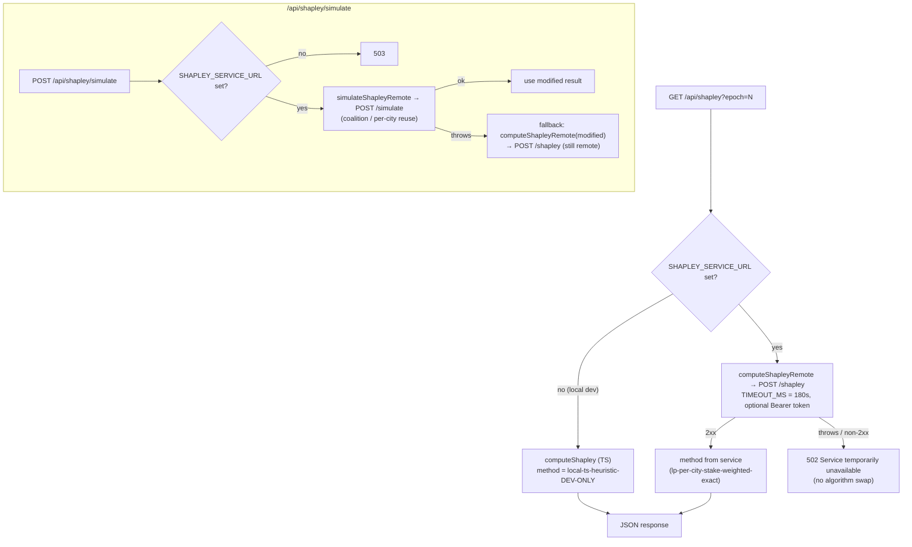

# Shapley Pipeline

How reward shares are computed: which inputs feed the solver, how requests are dispatched to the canonical engine, and how every response stays honest about which algorithm produced its numbers. For the queue/worker internals behind the async paths see [shapley-service.md](./shapley-service.md); for the UI flow see [architecture.md](./architecture.md).

## Contents

1. [Input-builder priority chain](#input-builder-priority-chain)
2. [Solver dispatch](#solver-dispatch)
3. [Method labels](#method-labels)
4. [The dev-only TS solver](#the-dev-only-ts-solver)
5. [Canonical engine (per-city)](#canonical-engine-per-city)
6. [Per-link value (retag method)](#per-link-value-retag-method)
7. [What-if simulation](#what-if-simulation)
8. [Correctness pinning](#correctness-pinning)

---

## Input-builder priority chain

Every snapshot-driven route assembles a `ShapleyInput` (devices, private links, public links, demands, plus tuning params) before it can solve. `app/api/shapley/route.ts` triages three builders from highest to lowest fidelity and stamps the chosen source into the response so a consumer can always tell where the numbers came from.

| Priority | Source label (`inputSource`) | Builder | When it is used |
|---|---|---|---|
| 1 | `canonical-foundation` | `lib/utils/canonical-inputs.ts` | `DZ_CANONICAL_INPUTS_URL` is set and the four per-epoch CSVs fetch cleanly |
| 2 | `canonical-snapshot` | `lib/utils/canonical-input-builder.ts` | the snapshot carries the canonical fields (`start_us`/`end_us` and `metro_prices`) |
| 3 | `snapshot-heuristic` | `lib/utils/shapley-input-builder.ts` | the snapshot lacks a canonical field, so the heuristic builder fills in |

The chain is strictly ordered. When `isCanonicalEnabled` (i.e. `DZ_CANONICAL_INPUTS_URL` is set), `fetchCanonicalInput(epoch)` in `canonical-inputs.ts` pulls `private_links.csv`, `devices.csv`, `public_links.csv`, and `demand.csv` for the epoch; if any of the four is missing the fetch returns `null`, the failure is logged, and the route falls through to the snapshot path. Otherwise the route downloads the snapshot and tries `buildCanonicalShapleyInput(raw)` from `canonical-input-builder.ts` — a TypeScript port of the Foundation reference builder. That function returns `{ canonical: false, reason }` when the snapshot is missing `start_us`/`end_us` or `metro_prices`, in which case the route runs `buildShapleyInput` from `shapley-input-builder.ts` as the heuristic fallback.

The `reason` returned by the canonical builder is surfaced on the response as `inputFallbackReason`. The two reason strings the builder emits are:

- `snapshot missing start_us/end_us epoch window`
- `snapshot missing metro_prices`

`inputFallbackReason` is only populated on the `canonical-snapshot → snapshot-heuristic` fallback; a `canonical-foundation` hit (or a clean `canonical-snapshot` build) leaves it undefined. The full response shape from `/api/shapley` carries `method`, `inputSource`, `inputFallbackReason`, `operatorCount`, `values`, and an `inputSummary` (device/link/demand counts). The input-source label is also surfaced through `/methodology` and the UI's method badge.

> Tuning constants (`operator_uptime`, `contiguity_bonus`, `demand_multiplier`) are emitted by every builder, but the two builders intentionally differ on `demand_multiplier`: the canonical builder hardcodes the Foundation-faithful `1.2` (`DEMAND_MULTIPLIER` in `canonical-input-builder.ts`), while the heuristic builder uses `SHAPLEY_PARAMS.demandMultiplier = 1.0` from `lib/constants/config.ts`. The divergence is deliberate — the multiplier normalizes out of the final share proportions — and the canonical values are verified against the Foundation reference on a pinned mainnet epoch.

### DoubleZero-current reward params (post-#369)

Two params define DoubleZero's current (post-PR #369) reward methodology and are **config-driven** via `CANONICAL_SHAPLEY_PARAMS` in `lib/constants/config.ts`, mirroring DZ's shipped `contributor-rewards` config (env-overridable):

| Param | Config / env | Default (DZ-current) | Epoch-149 (historical) | Effect |
|---|---|---|---|---|
| IBRL/unicast demand priority | `ibrlPriority` / `DZ_IBRL_PRIORITY` | `20.0` | `0.0` | objective weight of validator↔validator (unicast) demands; `0` = unicast unvalued |
| Public-latency multiplier | `publicLatencyMultiplier` / `DZ_PUBLIC_LATENCY_MULTIPLIER` | `1.25` | `1.0` | scales public-internet link latency (DZ's M/M/1 loaded-vs-baseline model); `1.0` = raw pass-through |

The canonical builder (`buildCanonicalShapleyInput(snap, override?)`) reads these from config by default; pass an explicit `override` to reproduce a specific historical epoch (e.g. epoch 149 uses `{ ibrlPriority: 0, publicLatencyMultiplier: 1 }`, as `scripts/gen-epoch149-parity-fixture.ts` does). The DZ-current defaults are **empirically parity-verified against DoubleZero's own `export shapley`** on mainnet epoch 184 — operator proportions match to `max |Δ| = 2.35e-15`. The epoch-149 golden (`services/shapley-rs/tests/parity_epoch149.rs`) remains pinned to the historical params and is a superseded anchor, not the current-parity gate. (The fallback heuristic builder does not yet consume these two params — tracked follow-up.)

## Solver dispatch

`lib/utils/shapley-remote.ts` is the single place that talks to the Rust microservice. `computeShapleyRemote(input)` POSTs the input as JSON to the `/shapley` endpoint of `SHAPLEY_SERVICE_URL`, with `Content-Type: application/json` and — when `SHAPLEY_API_TOKEN` is set — an `Authorization: Bearer ${SHAPLEY_API_TOKEN}` header that is never exposed to the browser. The request timeout constant `TIMEOUT_MS` is `180_000` (180s). The function throws on a missing URL, a network failure, or any non-2xx response.

The governing rule is **no silent fallback**: a canonical route must never quietly swap algorithms when the service is unhealthy, because that would hide divergence between the two solvers in production. Concretely:

- `/api/shapley`, `/api/shapley/baseline`, and `/api/shapley/tracking` require the Rust service when `SHAPLEY_SERVICE_URL` is set. A service failure returns **502**; an unset URL on the tracking route (which exists to detect drift in the canonical solver) returns **503**. None of them substitute the TS solver.
- `/api/shapley/baseline` has one narrow, non-silent carve-out: when the latest epoch's solve is cut mid-flight by a timeout (client abort, upstream `504` from the HAProxy route, or `408` from the service's own `TimeoutLayer`) the route returns **202 `{status: "warming", message, epoch}`** — the epoch exists but its result isn't cached yet, and healing is two-layered: the service finishes a cut solve in a detached task so the result still lands in the cache (warming self-heals on a later request), and the `/api/shapley/precompute` cron proactively warms each new epoch so user requests rarely go cold at all. The classification lives in `ShapleyServiceError.warming` (`lib/utils/epoch-shapley.ts`), fed by the typed `RemoteSolveError` from `shapley-remote.ts`. Every warming response is still reported to observability (`phase: "warming"`) — a broken cron surfaces as sustained warming reports, not silence. All other failures (service down, router 502/503, Rust 4xx/5xx, snapshot-fetch errors) remain hard **502**s.
- **Only** when `SHAPLEY_SERVICE_URL` is *unset* (local dev, no Rust service running) does `/api/shapley` (and `/api/shapley/baseline`) fall back to the in-process TS solver, and it stamps the result `local-ts-heuristic-DEV-ONLY` so the non-canonical path is impossible to miss.
- `/api/shapley/tracking` runs the latest N snapshots through `tryComputeShapleyRemote` (the soft-failure variant); any epoch the service can't compute lands in `skippedEpochs[]` with a `snapshot-fetch-failed` or `rust-solver-failed` reason, rather than being filled by a different algorithm.

`/api/shapley/simulate` is the one route with a remote-to-remote fallback. Its primary path is `simulateShapleyRemote(baseline, modified)`, which calls the service's `/simulate` endpoint in one shot and reuses unchanged work across the two solves. If that call throws, the route falls back to a **second remote call** — `computeShapleyRemote(modifiedInput)` against `/shapley` — and never to the TS solver. If `SHAPLEY_SERVICE_URL` is unset the route returns 503 up front.

`SHAPLEY_SERVICE_URL` is validated at module load in `lib/constants/config.ts` (scheme must be `http`/`https`; a malformed value fails loudly at startup). `shapleyEndpointUrl()` / `shapleyServiceBase()` normalize the configured base so any known endpoint suffix is stripped before the requested one is appended, and `PYTHON_SHAPLEY_URL` is accepted as a legacy alias.

## Method labels

Every Shapley response carries a `method` string. The table below enumerates the labels the system can emit and where each is set. The label is surfaced through `/methodology` and the UI method badge.

| Label | Set by | Meaning |
|---|---|---|
| `lp-per-city-stake-weighted-exact` | `compute_per_city` in `services/shapley-rs/src/routes.rs` | Canonical reward path: per-source-city exact Shapley + stake-weighted aggregation. This is what the Rust `/shapley`, `/simulate`, and `/precompute` paths actually return. |
| `lp-multi-commodity-flow-rs` | `DEFAULT_METHOD` in `lib/utils/shapley-remote.ts` | The default the TS client substitutes if a service response omits `method` — never reached with the current service, which always stamps its own label. Some UI checks (`components/contributors/reward-reconciliation.tsx`, `app/methodology/page.tsx`) still compare against this string and therefore never match a live response — known drift, also flagged in [architecture.md](./architecture.md). |
| `retag-shapley-rs` | `run_link_estimate` in `services/shapley-rs/src/routes.rs` | Per-link value (retag method) — see below. |
| `local-ts-heuristic-DEV-ONLY` | `app/api/shapley/route.ts`, `app/api/shapley/baseline/route.ts` | The in-process TS solver, emitted only when `SHAPLEY_SERVICE_URL` is unset. Never produced in production. |

`scripts/validate-shapley.ts` additionally recognizes `coalition-enumeration-v1-fallback` as a **legacy** label that should no longer appear; nothing in the current code emits it.

## The dev-only TS solver

`lib/utils/shapley-solver.ts` is a self-contained, in-process solver used **only** for local development when no Rust service is configured. It is directionally correct but is **not** the canonical LP and is never used in production.

How it works, as written:

- **Coalition enumeration.** It collects the distinct operators, sorts them, and enumerates all `2^n` coalitions as bitmasks (`computeShapley`). It throws for `n > 20` (`2^20 = 1M` coalitions is the stated ceiling).
- **Value function — greedy bandwidth-aware demand packing.** For each coalition it builds a directed graph (`buildCoalitionGraph`): private links between two active-operator endpoints get finite Gbps capacity (bidirectional as two edges); public links are added with `Infinity` capacity (uncapped internet baseline). Demands are sorted by priority descending and routed greedily via a shortest-path search (`shortestPathWithCapacity`) that skips edges whose residual capacity can't carry the demand, then debits residual along the chosen path. Each routed demand contributes `traffic * priority * receivers / (1 + latency)`, and the coalition total is scaled by `demand_multiplier`.
- **Contiguity penalty.** The path search adds a per-crossover penalty when a route transitions between private and public edges. Note the value function calls this with a hardcoded `10` (ms per private↔public crossing) rather than the input's `contiguity_bonus`.
- **Uptime adjustment.** `applyUptime` replaces each coalition value with its expected value under independent per-operator availability before the Shapley step (skipped when uptime ≥ 0.9999).
- **Shapley weighting.** Marginal contributions are weighted by `|S|! · (n−|S|−1)! / n!` (`precomputeFactorials`), then normalized to shares (`share = value / Σ value`).

Limitations called out in the file's own comments: public-internet edges are uncapped (`Infinity`), full-duplex links are modeled as two edges sharing a nominal capacity, and the routing is a greedy priority-ordered packing rather than a true multi-commodity flow LP. `/methodology` summarizes it the same way: "The TS fallback uses bandwidth-aware greedy demand packing." Treat its numbers as a development sanity check, not canonical output.

## Canonical engine (per-city)

The production solver is the Rust microservice in `services/shapley-rs`, which wraps the `network-shapley` crate. The dependency is pinned in `services/shapley-rs/Cargo.toml` to the public fork `github.com/phaselabscrypto/network-shapley-rs` at a fixed rev (`db60fd3b2e62e223cde440f9b2805a337e4142c1`). LP-solver internals live in that crate; this repo's job is the wire translation, the per-city decomposition, and the caps.

**Per-source-city decomposition.** `compute_per_city` in `services/shapley-rs/src/routes.rs` groups demands by their source city (`demand.start`), runs the engine's **exact** coalition Shapley for each city over the shared topology with that city's demands, and then aggregates across cities by stake weight. Cities are solved sequentially so the engine's per-worker warm-start coalition solver isn't thrashed; each city's own coalition solve is internally parallel. The aggregation (`aggregate_per_city`) computes `operator_value[op] += value * weight` across cities, skips zero-weight cities entirely, and reports a **raw** `share = value / Σ value` — which can be negative or exceed 1 (clamping happens only at reward-leaf conversion, not here).

**City weights.** The weights arrive on the request as `city_weights`, keyed identically to `demand.start`. They are computed TS-side from leader-schedule stake share (`calculateCityWeights` in `canonical-input-builder.ts`: `city.stakeProxy / Σ stakeProxy`, falling back to uniform `1/n` only when the global total is 0). A request with empty `city_weights` is rejected on the reward path with a `city_weights missing` error — there is no monolithic fallback.

**Demand type normalization.** `build_input` reassigns each demand a unique type per `(start, multicast, priority)` group before handing it to the engine, because the upstream LP models each `type` as a single-source multi-commodity flow and rejects a type whose rows disagree on those properties.

**Uptime penalty.** The engine applies the upstream `network-shapley` crate's uptime penalty model when converting per-link uptime into effective capacity. The exact formula and its coefficients live in the upstream crate, not in this repository, so they are not reproduced here — see the pinned fork. <!-- UNVERIFIED: the precise uptime→bandwidth penalty formula is not present in this repo; only the upstream crate defines it -->

## Per-link value (retag method)

`/link-estimate` answers "what is each of operator X's links worth?" It is a faithful port of the Python `network_linkestimate`, distinct from the per-city reward methodology. `run_link_estimate` in `services/shapley-rs/src/routes.rs` delegates to the engine's `network_link_estimate` (in the pinned upstream crate), which retags each focus-owned link as its own pseudo-operator and runs **one** exact `2^n` coalition Shapley over the epoch's full demand set; every non-focus operator collapses to a single `Others` player (on/off-ramps collapse to `Private`). The result is labeled `retag-shapley-rs`. Per-link `value` is signed (negatives mean no positive contribution) and `percent` is `max(value, 0) / Σ max(value, 0)`.

Because players = focus links + collapsed players, cost grows as `2^players`, which bounds the caps (all in `services/shapley-rs/src/routes.rs`):

| Cap | Constant | Limit | Effect |
|---|---|---|---|
| Sync `/link-estimate` | `SYNC_MAX_FOCUS_LINKS` | 12 focus links | Above this the sync path returns **422** directing the caller to the async `POST /jobs/link-estimate` |
| Sweep child | `SWEEP_MAX_FOCUS_LINKS` | 19 focus links | Operators above this are reported in the sweep summary's `skipped` list rather than enqueued as a guaranteed-to-fail job |
| Engine player cap | `MAX_OPERATORS` | 20 | Distinct operators (Shapley players) rejected above this at the API boundary on every path |

`count_focus_links` counts a link as focus-owned when either endpoint's device belongs to the focus operator. Results are served from an S3 cache before the sync cap is even checked, so a precomputed large operator is servable even when computing it inline would not be. The async job path and the per-epoch precompute sweep are covered in [shapley-service.md](./shapley-service.md) (queue mechanics) and [architecture.md](./architecture.md) (UI flow).

## What-if simulation

The simulator answers "how would operator X's share change if these links were added/removed or these demands overridden?" The Next.js route `app/api/shapley/simulate/route.ts` builds the baseline input (preferring the canonical builder), constructs a modified input via `modifyShapleyInput`, and calls `simulateShapleyRemote`, which hits the Rust `/simulate` endpoint (or `POST /jobs/simulate` for the async job path).

The Rust `simulate` handler (`services/shapley-rs/src/routes.rs`):

1. Serves or computes the **baseline** per-city values, caching them per epoch (in-memory, with an S3 fallback that rehydrates memory on a hit).
2. Determines which source cities the what-if left unchanged via `reusable_city_values` and reuses their baseline values verbatim; only touched cities are re-solved. A topology edit (any device/link/tuning change) invalidates every city; a pure demand-override reuses the cities it didn't touch.
3. Returns both results plus `stats`.

The `stats` block (`SimulateStats`) carries `baseline_cache_hit`, `coalitions_reused`, `coalitions_solved`, `baseline_ms`, and `modified_ms`. Under the per-city architecture the `coalitions_reused`/`coalitions_solved` fields carry **per-city** counts (the wire names are kept for stability), matching the `cities_reused`/`cities_solved` the per-city result reports. The Next.js route logs these as `cache_hit`, `reused`, `solved`, `baseline_ms`, `modified_ms` on each request.

## Correctness pinning

The pipeline is pinned at two layers: the Rust engine wrapper (per-coalition and full-epoch parity) and the TS input builder / live pipeline. The fixtures:

| Test / script | What it asserts |
|---|---|
| `services/shapley-rs/tests/upstream_simple.rs` | Feeds the upstream `simple` example **directly** to the engine (`network_shapley::ShapleyInput::compute`) and asserts Alpha/Beta values match the upstream README within 1% — pins the engine at the rev this service builds against. (It does not exercise this service's `build_input` wire translation, despite its own stale header comment.) |
| `services/shapley-rs/tests/three_operator.rs` | Structural correctness for a 3-operator scenario (all operators present, shares sum to ~1, sensible ordering). Currently `#[ignore]`d — its comment cites upstream's demand-uniformity rule pending a fixture reshape. |
| `services/shapley-rs/tests/parity_epoch149.rs` | Full-epoch reward-leaf parity: runs the real per-city path over the epoch-149 fixture, converts proportions to on-chain `unit_share`s (`MAX_UNIT_SHARE = 1_000_000_000`) and asserts they equal the actual on-chain leaves. Gated `#[ignore]` (long-running per-city exact solve) and skips when the fixture is absent. Ships with a cheap always-on unit test of the leaf-conversion math. |
| `services/shapley-rs/tests/dedup_devices.rs` | Canonical per-operator device naming over the HTTP `/shapley` endpoint: unique names succeed (200), duplicate device names are rejected by upstream validation (422). |
| `services/shapley-rs/tests/smoke.sh` | Deployed-service E2E: `/health`, `/shapley` against the `simple` fixture (1% tolerance), `/link-estimate` returns method `retag-shapley-rs`, `/shapley` three-operator structural check, and a `/health` latency budget. |
| `scripts/test-canonical-parity.ts` (`pnpm test:canonical`) | Diffs the TS canonical builder (`canonical-input-builder.ts`) against the Foundation Python reference over all four tables (devices, private_links, public_links, demands), with small float tolerances on derived latency/uptime; exits non-zero on any mismatch. |
| `scripts/validate-shapley.ts` (`pnpm validate`) | Hits `/api/shapley?epoch=N` across epochs and writes `validation-report.md`: methods used, input sources, per-epoch invariants (shares sum to ~1 within 0.001 — exits non-zero if any fail), cross-epoch stability, and informational drift vs the economic-hub all-time shares. |

---

### See also

- [README.md](../README.md) — documentation index
- [architecture.md](./architecture.md) — system overview and UI flow
- [data-sources.md](./data-sources.md) — snapshots, on-chain reads, and live feeds
- [shapley-service.md](./shapley-service.md) — the Rust service, queue, and workers
- [development.md](./development.md) — local setup
- [operations.md](./operations.md) — deployment and runbooks
- [adr/0001-async-compute-queue.md](./adr/0001-async-compute-queue.md) — the async compute queue decision
- Upstream engine fork: [github.com/phaselabscrypto/network-shapley-rs](https://github.com/phaselabscrypto/network-shapley-rs)
