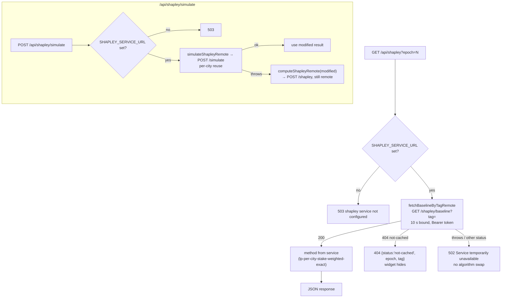

# Shapley Pipeline

How reward shares are computed: which inputs feed the solver, how requests are dispatched to the canonical engine, and how every response stays honest about which algorithm produced its numbers. For the queue/worker internals behind the async paths see [shapley-service.md](./shapley-service.md); for the UI flow see [architecture.md](./architecture.md).

## Contents

1. [Input construction](#input-construction)
2. [Solver dispatch](#solver-dispatch)
3. [Method labels](#method-labels)
4. [Canonical engine (per-city)](#canonical-engine-per-city)
5. [Per-link value (retag method)](#per-link-value-retag-method)
6. [Limits](#limits)
7. [What-if simulation](#what-if-simulation)
8. [Correctness pinning](#correctness-pinning)

---

## Input construction

There is one input source and one builder. The precompute cron downloads the epoch snapshot once per fire (`fetchEpochSnapshot` in `lib/utils/epoch-snapshot.ts`, 120 s timeout) and builds the `ShapleyInput` with `buildCanonicalShapleyInput` from `lib/utils/canonical-input-builder.ts`, a TypeScript port of the Foundation reference builder. `fetchEpochSnapshot` checks the envelope and that the file names the epoch that was asked for, so a mismatched or truncated download fails the fire instead of producing a wrong input.

The builder returns `{ canonical: false, reason }` when the snapshot lacks `start_us`/`end_us` or `metro_prices`. The caller then answers `422` and records the reason. The two reasons are:

- `snapshot missing start_us/end_us epoch window`
- `snapshot missing metro_prices`

The simulate and job routes build from the snapshot the same way and answer `422` on the same condition. The link-value job route asks the service for the precomputed result by epoch tag first and downloads a snapshot only when no result is published.

Published baselines are addressed by an epoch tag rather than by the hash of the input, because deriving that hash means downloading the snapshot. `sweepTag(epoch)` in `lib/utils/sweep-tag.ts` is `epoch-<N>:canonical-v1:<fnv1a of "ibrl=<value>;plm=<value>">`, and `baselineTag(epoch)` prefixes it with `baseline:`. The fingerprint covers the two reward params below, so changing either makes every published alias and sweep marker miss and the next fire republishes under the new tag.

> The builder emits the tuning constants `operator_uptime`, `contiguity_bonus`, and `demand_multiplier`. It hardcodes the Foundation-faithful `demand_multiplier` of `1.2` (`DEMAND_MULTIPLIER` in `canonical-input-builder.ts`). The multiplier normalizes out of the final share proportions, and the values are verified against the Foundation reference on a pinned mainnet epoch.

### Reward params

Two params define DoubleZero's reward methodology. They come from `CANONICAL_SHAPLEY_PARAMS` in `lib/constants/config.ts`, which mirrors DZ's shipped `contributor-rewards` config, and each has an env override:

| Param | Config / env | Default | Epoch-149 (historical) | Effect |
|---|---|---|---|---|
| IBRL/unicast demand priority | `ibrlPriority` / `DZ_IBRL_PRIORITY` | `20.0` | `0.0` | objective weight of validator↔validator (unicast) demands; `0` = unicast unvalued |
| Public-latency multiplier | `publicLatencyMultiplier` / `DZ_PUBLIC_LATENCY_MULTIPLIER` | `1.25` | `1.0` | scales public-internet link latency (DZ's M/M/1 loaded-vs-baseline model); `1.0` = raw pass-through |

`buildCanonicalShapleyInput(snap, override?)` reads these from config by default. Pass an explicit `override` to reproduce a historical epoch; epoch 149 uses `{ ibrlPriority: 0, publicLatencyMultiplier: 1 }`, as `scripts/gen-epoch149-parity-fixture.ts` does. The defaults match DoubleZero's own `export shapley` on mainnet epoch 184 to `max |Δ| = 2.35e-15` in operator proportions. The epoch-149 fixture (`services/shapley-rs/tests/parity_epoch149.rs`) uses the historical params and is a regression input, not the parity gate for the current params.

## Solver dispatch

`lib/utils/shapley-remote.ts` is the single place that talks to the Rust microservice. `computeShapleyRemote(input)` POSTs the input as JSON to the `/shapley` endpoint of `SHAPLEY_SERVICE_URL`, with `Content-Type: application/json` and (when `SHAPLEY_API_TOKEN` is set) an `Authorization: Bearer ${SHAPLEY_API_TOKEN}` header that is never exposed to the browser. The request timeout constant `TIMEOUT_MS` is `180_000` (180s). The function throws on a missing URL, a network failure, or any non-2xx response.

The governing rule is **no silent fallback**. A canonical route never swaps algorithms or invents a number when the service is unhealthy, because that would hide divergence in production.

`/api/shapley`, `/api/shapley/baseline`, and `/api/shapley/tracking` are cache-only reads. Each probes `GET {service}/shapley/baseline?tag=<baselineTag(epoch)>` through `fetchBaselineByTagRemote`, a 10-second bounded call, and none of them starts a solve:

| Outcome | Response |
|---|---|
| Alias published | `200` with the alias body |
| No alias for that epoch | `404 {status:"not-cached", epoch, tag}`, and the widget hides |
| Timeout, network failure, or an unnamed status | `502` with a generic body |
| `SHAPLEY_SERVICE_URL` unset | `503` |

A miss is reported to observability as a `baseline-not-cached` event rather than an error, because it is the normal state of a fresh epoch. Sustained misses on the latest epoch mean the cron or the worker is broken. Nothing self-heals on a user request, because no reader computes. [ADR 0004](./adr/0004-cache-only-baseline-reads.md) records the decision.

Only the cron asks the service to compute. It posts `{input, tag}` to `POST {service}/precompute/baseline` with the compute and ingest tokens, and the worker solves or loads the baseline, persists it, then writes the epoch alias the readers probe.

```mermaid
flowchart TD
    A["GET /api/shapley?epoch=N"] --> B{"SHAPLEY_SERVICE_URL set?"}
    B -- "no" --> C["503 shapley service not configured"]
    B -- "yes" --> D["fetchBaselineByTagRemote<br/>GET /shapley/baseline?tag=<br/>10 s bound, Bearer token"]
    D -- "200" --> E["method from service<br/>(lp-per-city-stake-weighted-exact)"]
    D -- "404 not-cached" --> H["404 {status:'not-cached', epoch, tag}<br/>widget hides"]
    D -- "throws / other status" --> F["502 Service temporarily unavailable<br/>no algorithm swap"]
    E --> G["JSON response"]

    subgraph simulate ["/api/shapley/simulate"]
        S0["POST /api/shapley/simulate"] --> S1{"SHAPLEY_SERVICE_URL set?"}
        S1 -- "no" --> S2["503"]
        S1 -- "yes" --> S3["simulateShapleyRemote → POST /simulate<br/>per-city reuse"]
        S3 -- "ok" --> S4["use modified result"]
        S3 -- "throws" --> S5["computeShapleyRemote(modified)<br/>→ POST /shapley, still remote"]
    end
```

`/api/shapley/simulate` is the one route with a remote-to-remote fallback. Its primary path is `simulateShapleyRemote(baseline, modified)`, which calls the service's `/simulate` endpoint in one shot and reuses unchanged work across the two solves. If that call throws, the route falls back to a **second remote call**, `computeShapleyRemote(modifiedInput)` against `/shapley`. If `SHAPLEY_SERVICE_URL` is unset the route returns 503 up front.

`SHAPLEY_SERVICE_URL` is validated at module load in `lib/constants/config.ts` (scheme must be `http`/`https`; a malformed value fails loudly at startup). `shapleyEndpointUrl()` / `shapleyServiceBase()` normalize the configured base so any known endpoint suffix is stripped before the requested one is appended, and `PYTHON_SHAPLEY_URL` is accepted as an alias.

## Method labels

Every Shapley response carries a `method` string. `/api/methodology` publishes the same labels for external auditors.

| Label | Set by | Meaning |
|---|---|---|
| `lp-per-city-stake-weighted-exact` | `compute_per_city` in `services/shapley-rs/src/routes.rs` | Canonical reward path: per-source-city exact Shapley + stake-weighted aggregation. This is what the Rust `/shapley`, `/simulate`, and `/precompute` paths return. |
| `lp-multi-commodity-flow-rs` | `DEFAULT_METHOD` in `lib/utils/shapley-remote.ts` | The default the TS client substitutes when a service response omits `method`. The service always stamps its own label. |
| `retag-shapley-rs` | `run_link_estimate` in `services/shapley-rs/src/routes.rs` | Per-link value (retag method), described below. |

`components/economics/live-baseline-shapley.tsx` matches the `lp-` prefix and prints "Canonical LP", so a service-side rename inside that family does not break the UI.

## Canonical engine (per-city)

The production solver is the Rust microservice in `services/shapley-rs`, which wraps the `network-shapley` crate. The dependency is pinned in `services/shapley-rs/Cargo.toml` to the public fork `github.com/phaselabscrypto/network-shapley-rs` at rev `bb5a24e034daf9ad6680e393df85eaf6f20d987e`. The fork's upstream base is DoubleZero's `network-shapley-rs` v0.6.0. See the fork's [About this fork](https://github.com/phaselabscrypto/network-shapley-rs#about-this-fork) section for what the fork changes. LP-solver internals live in that crate; this repo's job is the wire translation, the per-city decomposition, and the caps.

**Per-source-city decomposition.** `compute_per_city` in `services/shapley-rs/src/routes.rs` groups demands by their source city (`demand.start`), runs the engine's **exact** coalition Shapley for each city over the shared topology with that city's demands, and then aggregates across cities by stake weight. Cities are solved sequentially so the engine's per-worker warm-start coalition solver isn't thrashed; each city's own coalition solve is internally parallel. The aggregation (`aggregate_per_city`) computes `operator_value[op] += value * weight` across cities, skips zero-weight cities entirely, and reports a **raw** `share = value / Σ value`, which can be negative or exceed 1 (clamping happens only at reward-leaf conversion, not here).

**City weights.** The weights arrive on the request as `city_weights`, keyed identically to `demand.start`. They are computed TS-side from leader-schedule stake share (`calculateCityWeights` in `canonical-input-builder.ts`: `city.stakeProxy / Σ stakeProxy`, falling back to uniform `1/n` only when the global total is 0). A request with empty `city_weights` is rejected on the reward path with a `city_weights missing` error. There is no monolithic fallback.

**Demand type normalization.** `build_input` reassigns each demand a unique type per `(start, multicast, priority)` group before handing it to the engine, because the upstream LP models each `type` as a single-source multi-commodity flow and rejects a type whose rows disagree on those properties.

**Uptime penalty.** The engine applies the upstream `network-shapley` crate's uptime penalty model when converting per-link uptime into effective capacity. The exact formula and its coefficients live in the upstream crate, not in this repository, so they are not reproduced here. See the pinned fork. <!-- UNVERIFIED: the precise uptime→bandwidth penalty formula is not present in this repo; only the upstream crate defines it -->

## Per-link value (retag method)

`/link-estimate` answers "what is each of operator X's links worth?" It is a faithful port of the Python `network_linkestimate`, distinct from the per-city reward methodology. `run_link_estimate` in `services/shapley-rs/src/routes.rs` delegates to the engine's `network_link_estimate` (in the pinned upstream crate), which retags each focus-owned link as its own pseudo-operator and runs **one** exact `2^n` coalition Shapley over the epoch's full demand set; every non-focus operator collapses to a single `Others` player (on/off-ramps collapse to `Private`). The result is labeled `retag-shapley-rs`. Per-link `value` is signed (negatives mean no positive contribution) and `percent` is `max(value, 0) / Σ max(value, 0)`.

Players are one pseudo-operator per focus-owned link, plus a single `Others` player for every non-focus operator. `Private` and `Public` are filtered out of the player set: they are never players. Cost is exactly `2^(links+1)` coalitions.

Measured on the production worker, 4 solver threads on a 16 GiB pod, from the `elapsed_ms` each link-estimate job logs:

| Focus links | Coalitions | Elapsed | ms/coalition |
|---|---|---|---|
| 1 | 4 | 9 s | 2,173 |
| 5 | 64 | 80 s | 1,256 |
| 7 | 256 | 101 s | 395 |
| 9 | 1,024 | 431 s | 421 |
| 10 | 2,048 | 774 s | 378 |
| 12 | 8,192 | 1,783 s | 218 |

The amortised rate is 218 ms per coalition. Projecting it past the measured range: 18 links is 31.7 h, 19 is 63.4 h, and 20 is about 127 h. A Solana epoch is 43.9 h, so 18 focus links is the largest breakdown that finishes inside one. The cap sits at 19. The [Limits](#limits) section below lists every cap this bounds, its value, and where the service enforces it.

`count_focus_links` counts a link as focus-owned when either endpoint's device belongs to the focus operator. Results are served from an S3 cache before the sync cap is even checked, so a precomputed large operator is servable even when computing it inline would not be. The async job path and the per-epoch precompute sweep are covered in [shapley-service.md](./shapley-service.md) (queue mechanics) and [architecture.md](./architecture.md) (UI flow).

## Limits

| Cap | Value | Enforced where | Reason |
|---|---|---|---|
| Sync `/link-estimate` focus cap | `SYNC_MAX_FOCUS_LINKS` = 12 | `link_estimate` handler, `services/shapley-rs/src/routes.rs` | 12 focus links is 8,192 coalitions, measured at 1,783 s. Above it the sync path returns 422 and points the caller at `POST /jobs/link-estimate`. Nothing in the site calls this path; the page uses the async one |
| Sweep / async focus cap | `SWEEP_MAX_FOCUS_LINKS` = 19 | `link_estimate_start` (422) and `run_sweep` (skip), `services/shapley-rs/src/routes.rs` and `src/worker.rs` | The user-facing limit. 19 focus links is 1,048,576 coalitions, about 63.4 h. Operators above it get no per-link breakdown and are listed in the sweep summary's `skipped`. `MAX_BREAKDOWN_FOCUS_LINKS` in `lib/constants/config.ts` mirrors it so the UI matches |
| Frontend focus-link mirror | `MAX_BREAKDOWN_FOCUS_LINKS` = 19 | `lib/constants/config.ts` | Mirrors `SWEEP_MAX_FOCUS_LINKS` so the operator picker in the UI matches what the backend will solve. |
| Engine operator cap, full uptime | `MAX_OPERATORS` = 20 | `check_operator_limit`, `network-shapley-rs/src/validation.rs` | Coalition cost is `2^n`; the exact solver is infeasible past 20 operators at `operator_uptime = 1.0`. Enforced inside the engine, not by the service's `validate_dimensions`. |
| Engine operator cap, partial uptime | `MAX_OPERATORS_PARTIAL_UPTIME` = 15 | `check_operator_limit`, `network-shapley-rs/src/validation.rs` | Applies when `operator_uptime < 1.0` (production uses 0.98). The uptime expectation pass costs more than the plain coalition solve, so the cap tightens to 15. |
| Link-estimate player cap | `MAX_LINK_PLAYERS` = 31 | `network_link_estimate`, `network-shapley-rs/src/link_estimate.rs` | Coalition membership is a `u32` bitmask; bit 31 is a reserved always-in sentinel, so players occupy bits 0-30 (31 positions). Link estimation is exempt from `MAX_OPERATORS`: its cost depends on the focus operator's link count, not the network's total operator count. |

## What-if simulation

The simulator answers "how would operator X's share change if these links were added/removed or these demands overridden?" The Next.js route `app/api/shapley/simulate/route.ts` builds the baseline input with the canonical builder, constructs a modified input via `modifyShapleyInput`, and calls `simulateShapleyRemote` against the Rust `/simulate` endpoint. The `/simulate` page itself drives the async path, `POST /api/shapley/jobs`, because a full re-solve takes minutes.

The Rust `simulate` handler (`services/shapley-rs/src/routes.rs`):

1. Serves or computes the **baseline** per-city values, caching them per epoch (in-memory, with an S3 fallback that rehydrates memory on a hit).
2. Determines which source cities the what-if left unchanged via `reusable_city_values` and reuses their baseline values verbatim; only touched cities are re-solved. A topology edit (any device/link/tuning change) invalidates every city; a pure demand-override reuses the cities it didn't touch.
3. Returns both results plus `stats`.

The `stats` block (`SimulateStats`) carries `baseline_cache_hit`, `coalitions_reused`, `coalitions_solved`, `baseline_ms`, and `modified_ms`. Under the per-city architecture the `coalitions_reused`/`coalitions_solved` fields carry **per-city** counts (the wire names are kept for stability), matching the `cities_reused`/`cities_solved` the per-city result reports. The Next.js route logs these as `cache_hit`, `reused`, `solved`, `baseline_ms`, `modified_ms` on each request.

## Correctness pinning

The pipeline is pinned at two layers: the Rust engine wrapper and the TS input builder. The fixtures:

| Test / script | What it asserts |
|---|---|
| `services/shapley-rs/tests/upstream_simple.rs` | Feeds the upstream `simple` example **directly** to the engine (`network_shapley::ShapleyInput::compute`) and asserts Alpha/Beta values match the upstream README within 1%: pins the engine at the rev this service builds against. (It does not exercise this service's `build_input` wire translation, despite its own stale header comment.) |
| `services/shapley-rs/tests/three_operator.rs` | Structural correctness for a 3-operator scenario (all operators present, shares sum to ~1, sensible ordering). Currently `#[ignore]`d: its comment cites upstream's demand-uniformity rule pending a fixture reshape. |
| `services/shapley-rs/tests/parity_epoch149.rs` | Runs the real per-city path over a frozen epoch-149 input fixture and converts proportions to `unit_share`s (`MAX_UNIT_SHARE = 1_000_000_000`). The fixture predates the current uptime-penalty model, so the test is a regression check on our own pipeline, kept `#[ignore]`d and run by hand. It makes no statement about on-chain results. |
| `services/shapley-rs/tests/dedup_devices.rs` | Canonical per-operator device naming over the HTTP `/shapley` endpoint: unique names succeed (200), duplicate device names are rejected by upstream validation (422). |
| `services/shapley-rs/tests/link_estimate_http.rs` | The `/link-estimate` wire contract the frontend depends on, including the 12-focus-link sync cap. |
| `services/shapley-rs/tests/shapley_single_flight.rs` | Concurrent cold `/shapley` requests for one input hash produce exactly one solve. Followers wait and never start their own. |
| `services/shapley-rs/tests/baseline_alias_http.rs` | `GET /shapley/baseline?tag=` and `POST /precompute/baseline` over a mock S3 with no Redis: the probe never computes or enqueues, and hit, miss, malformed, and store-failure each get their own status. |
| `services/shapley-rs/tests/alias_publication.rs` | Alias and marker publication end to end through a real worker and Redis with a mock S3: the result lands before the alias, the marker lands only after every alias, and an explicit operator subset publishes neither. |
| `services/shapley-rs/tests/link_estimate_alias.rs` | `load_link_estimate_alias` separates a miss from an outage from a malformed body, without Redis or HTTP. |
| `services/shapley-rs/tests/diff_parity.rs`, `diff_persistence.rs` | Frozen wire parity for the two diff bodies over the committed epoch 204-211 shapes, and the conditional-write rules of the shape store: create, conflict, corrupt repair, and healthy bytes left alone. |
| `services/shapley-rs/tests/smoke.sh` | Deployed-service E2E: `/health`, `/shapley` against the `simple` fixture (1% tolerance), `/link-estimate` returns method `retag-shapley-rs`, the three-operator structural check, `/diff` and `/diff/contributor/tsw` over epochs 204-211, the `/shapley/baseline` miss contract, and a `/health` latency budget. |
| `scripts/test-canonical-parity.ts` (`pnpm test:canonical`) | Diffs the TS canonical builder (`canonical-input-builder.ts`) against the Foundation Python reference over all four tables (devices, private_links, public_links, demands), with small float tolerances on derived latency/uptime; exits non-zero on any mismatch. |
| `scripts/test-precompute-ingest.ts` (`pnpm test:precompute-ingest`) | The cron fire against a stubbed service: one snapshot download feeding sweep, baseline alias, and diff shape; the already-swept short-circuit; the alias-only publish; budget exhaustion; history repair. |
| `scripts/test-baseline-probe.ts`, `test-tracking-route.ts`, `test-baseline-tag.ts` | The cache-only read routes and the epoch tag: hit, miss, upstream failure, probe timeout, count clamping, tag determinism. |
| `scripts/validate-shapley.ts` (`pnpm validate`) | Hits `/api/shapley?epoch=N` across epochs and writes `validation-report.md`: methods used, per-epoch invariants (shares sum to ~1 within 0.001; exits non-zero if any fail), cross-epoch stability, and informational drift vs the economic-hub all-time shares. An epoch the cron has not published answers 404 and is skipped. |

---

### See also

- [README.md](../README.md): documentation index
- [architecture.md](./architecture.md): system overview and UI flow
- [data-sources.md](./data-sources.md): snapshots, on-chain reads, and live feeds
- [shapley-service.md](./shapley-service.md): the Rust service, queue, and workers
- [development.md](./development.md): local setup
- [operations.md](./operations.md): deployment and runbooks
- [adr/0001-async-compute-queue.md](./adr/0001-async-compute-queue.md): the async compute queue decision
- [adr/0004-cache-only-baseline-reads.md](./adr/0004-cache-only-baseline-reads.md): why reads never compute and baselines are keyed by epoch tag
- Upstream engine fork: [github.com/phaselabscrypto/network-shapley-rs](https://github.com/phaselabscrypto/network-shapley-rs)
