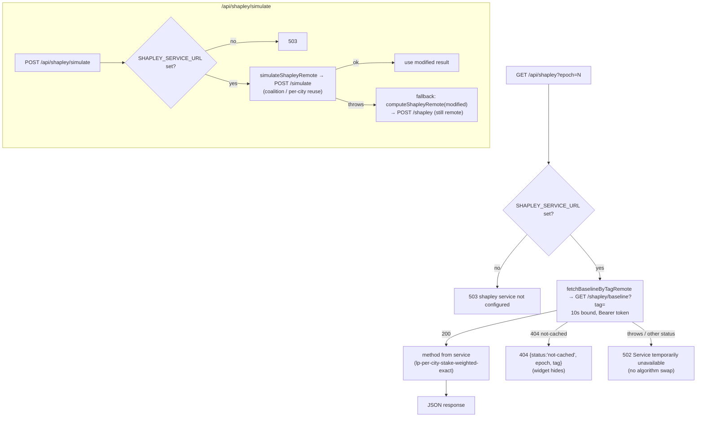

# Shapley Pipeline

How reward shares are computed: which inputs feed the solver, how requests are dispatched to the canonical engine, and how every response stays honest about which algorithm produced its numbers. For the queue/worker internals behind the async paths see [shapley-service.md](./shapley-service.md); for the UI flow see [architecture.md](./architecture.md).

## Contents

1. [Input construction](#input-construction)
2. [Solver dispatch](#solver-dispatch)
3. [Method labels](#method-labels)
4. [Canonical engine (per-city)](#canonical-engine-per-city)
5. [Per-link value (retag method)](#per-link-value-retag-method)
6. [What-if simulation](#what-if-simulation)
7. [Correctness pinning](#correctness-pinning)

---

## Input construction

The precompute cron (`lib/utils/precompute-ingest.ts`) downloads the epoch snapshot once per fire with `fetchEpochSnapshot` (`lib/utils/epoch-snapshot.ts`), which checks the envelope and that the file names the requested epoch, and builds the `ShapleyInput` with `buildCanonicalShapleyInput` from `canonical-input-builder.ts`, a TypeScript port of the Foundation reference builder. That snapshot is the only input source for published baselines and link-value sweeps; there is no Foundation CSV source and no heuristic substitute on this path.

The canonical builder returns `{ canonical: false, reason }` when the snapshot is missing `start_us`/`end_us` or `metro_prices`. The cron then fails the fire with `422` and the reason is recorded under `errors`. The two reason strings the builder emits are:

- `snapshot missing start_us/end_us epoch window`
- `snapshot missing metro_prices`

The read routes carry only what the published alias holds (`epoch`, `tag`, `method`, `operatorCount`, `values`, `fetchedAt`). The simulate and jobs routes build from the snapshot the same way and answer `422` when the canonical builder cannot use it. The link-value job route first asks the service for the precomputed result by epoch tag (`POST /jobs/link-estimate/by-tag`), and downloads the snapshot only when no alias exists.

The epoch tag that names every published artifact is `sweepTag(epoch)` in `lib/utils/sweep-tag.ts`: `epoch-<N>:canonical-v1:<fnv1a of "ibrl=<DZ_IBRL_PRIORITY>;plm=<DZ_PUBLIC_LATENCY_MULTIPLIER>">`, with `baselineTag(epoch) = "baseline:" + sweepTag(epoch)`. The fingerprint means a change to either reward param makes every existing alias and sweep marker miss, and the next cron fire republishes under the new tag rather than serving numbers built with the old params.

> The canonical builder emits the tuning constants `operator_uptime`, `contiguity_bonus`, and `demand_multiplier`. It hardcodes the Foundation-faithful `demand_multiplier` of `1.2` (`DEMAND_MULTIPLIER` in `canonical-input-builder.ts`). The multiplier normalizes out of the final share proportions, and the values are verified against the Foundation reference on a pinned mainnet epoch.

### Reward params

Two params define DoubleZero's reward methodology. They come from `CANONICAL_SHAPLEY_PARAMS` in `lib/constants/config.ts`, which mirrors DZ's shipped `contributor-rewards` config, and each has an env override:

| Param | Config / env | Default (DZ-current) | Epoch-149 (historical) | Effect |
|---|---|---|---|---|
| IBRL/unicast demand priority | `ibrlPriority` / `DZ_IBRL_PRIORITY` | `20.0` | `0.0` | objective weight of validator↔validator (unicast) demands; `0` = unicast unvalued |
| Public-latency multiplier | `publicLatencyMultiplier` / `DZ_PUBLIC_LATENCY_MULTIPLIER` | `1.25` | `1.0` | scales public-internet link latency (DZ's M/M/1 loaded-vs-baseline model); `1.0` = raw pass-through |

The canonical builder (`buildCanonicalShapleyInput(snap, override?)`) reads these from config by default. Pass an explicit `override` to reproduce a specific historical epoch; epoch 149 uses `{ ibrlPriority: 0, publicLatencyMultiplier: 1 }`, as `scripts/gen-epoch149-parity-fixture.ts` does. The defaults match DoubleZero's own `export shapley` on mainnet epoch 184 to `max |Δ| = 2.35e-15` in operator proportions. The epoch-149 fixture (`services/shapley-rs/tests/parity_epoch149.rs`) uses the historical params and is a regression input, not the parity gate for the current params.

## Solver dispatch

`lib/utils/shapley-remote.ts` is the single place that talks to the Rust microservice. `computeShapleyRemote(input)` POSTs the input as JSON to the `/shapley` endpoint of `SHAPLEY_SERVICE_URL`, with `Content-Type: application/json` and, when `SHAPLEY_API_TOKEN` is set, an `Authorization: Bearer ${SHAPLEY_API_TOKEN}` header that never reaches the browser. The request timeout constant `TIMEOUT_MS` is `180_000` (180s). The function throws on a missing URL, a network failure, or any non-2xx response. Only `/api/shapley/simulate` calls it; the reward-facing routes use `fetchBaselineByTagRemote`, a 10-second cache-only read of `GET /shapley/baseline?tag=`.

The governing rule is **no silent fallback**: a canonical route must never quietly swap algorithms or invent a number when the service is unhealthy, because that would hide divergence in production. Concretely:

- `/api/shapley`, `/api/shapley/baseline` and `/api/shapley/tracking` are cache-only. Each probes `GET {service}/shapley/baseline?tag=<baselineTag(epoch)>` and never computes: a published alias is **200**, an epoch the cron has not published is **404 `{status:"not-cached", epoch, tag}`**, and any other outcome (timeout, network failure, a status the contract does not name) is a **502** with a generic body. An unset `SHAPLEY_SERVICE_URL` is **503** on all three. None of them substitute another algorithm, and none of them start a solve.
- Only `/api/link-value/precompute` (the cron) asks the service to compute. It posts `{input, tag}` to `POST {service}/precompute/baseline` with both tokens; the worker solves, persists the result, then writes the epoch alias the readers probe.
- A miss is reported to observability as a `baseline-not-cached` event rather than an error, because it is the normal state of a fresh epoch. Sustained events for the latest epoch mean the cron or the worker is broken.

```mermaid
flowchart TD
    A["GET /api/shapley?epoch=N"] --> B{"SHAPLEY_SERVICE_URL set?"}
    B -- "no" --> C["503 shapley service not configured"]
    B -- "yes" --> D["fetchBaselineByTagRemote → GET /shapley/baseline?tag=<br/>10s bound, Bearer token"]
    D -- "200" --> E["method from service<br/>(lp-per-city-stake-weighted-exact)"]
    D -- "404 not-cached" --> H["404 {status:'not-cached', epoch, tag}<br/>(widget hides)"]
    D -- "throws / other status" --> F["502 Service temporarily unavailable<br/>(no algorithm swap)"]
    E --> G["JSON response"]

    subgraph simulate ["/api/shapley/simulate"]
        S0["POST /api/shapley/simulate"] --> S1{"SHAPLEY_SERVICE_URL set?"}
        S1 -- "no" --> S2["503"]
        S1 -- "yes" --> S3["simulateShapleyRemote → POST /simulate<br/>(coalition / per-city reuse)"]
        S3 -- "ok" --> S4["use modified result"]
        S3 -- "throws" --> S5["fallback: computeShapleyRemote(modified)<br/>→ POST /shapley (still remote)"]
    end
```

`/api/shapley/simulate` is the one route with a remote-to-remote fallback. Its primary path is `simulateShapleyRemote(baseline, modified)`, which calls the service's `/simulate` endpoint in one shot and reuses unchanged work across the two solves. If that call throws, the route falls back to a **second remote call**, `computeShapleyRemote(modifiedInput)` against `/shapley`. If `SHAPLEY_SERVICE_URL` is unset the route returns 503 up front.

`SHAPLEY_SERVICE_URL` is validated at module load in `lib/constants/config.ts` (scheme must be `http`/`https`; a malformed value fails loudly at startup). `shapleyEndpointUrl()` / `shapleyServiceBase()` normalize the configured base so any known endpoint suffix is stripped before the requested one is appended, and `PYTHON_SHAPLEY_URL` is accepted as an alias.

## Method labels

Every Shapley response carries a `method` string. The table below enumerates the labels the system can emit and where each is set.

| Label | Set by | Meaning |
|---|---|---|
| `lp-per-city-stake-weighted-exact` | `compute_per_city` in `services/shapley-rs/src/routes.rs` | Canonical reward path: per-source-city exact Shapley plus stake-weighted aggregation. The Rust `/shapley`, `/simulate`, and `/precompute` paths return this label. |
| `lp-multi-commodity-flow-rs` | `DEFAULT_METHOD` in `lib/utils/shapley-remote.ts` | The default the TS client substitutes if a service response omits `method`. The service always stamps its own label. |
| `retag-shapley-rs` | `run_link_estimate` in `services/shapley-rs/src/routes.rs` | Per-link value (retag method), described below. |

## Canonical engine (per-city)

The production solver is the Rust microservice in `services/shapley-rs`, which wraps the `network-shapley` crate. The dependency is pinned in `services/shapley-rs/Cargo.toml` to the public fork `github.com/phaselabscrypto/network-shapley-rs` at a fixed rev (`bb5a24e034daf9ad6680e393df85eaf6f20d987e`; check `Cargo.toml` for the current pin). LP-solver internals live in that crate; this repo's job is the wire translation, the per-city decomposition, and the caps.

**Per-source-city decomposition.** `compute_per_city` in `services/shapley-rs/src/routes.rs` groups demands by their source city (`demand.start`), runs the engine's **exact** coalition Shapley for each city over the shared topology with that city's demands, and then aggregates across cities by stake weight. Cities are solved sequentially so the engine's per-worker warm-start coalition solver is not thrashed; each city's own coalition solve is internally parallel. The aggregation (`aggregate_per_city`) computes `operator_value[op] += value * weight` across cities, skips zero-weight cities entirely, and reports a **raw** `share = value / Σ value`, which can be negative or exceed 1. Clamping happens at reward-leaf conversion, not here.

**City weights.** The weights arrive on the request as `city_weights`, keyed identically to `demand.start`. They are computed TS-side from leader-schedule stake share (`calculateCityWeights` in `canonical-input-builder.ts`: `city.stakeProxy / Σ stakeProxy`, falling back to uniform `1/n` only when the global total is 0). A request with empty `city_weights` is rejected on the reward path with a `city_weights missing` error. There is no monolithic fallback.

**Demand type normalization.** `build_input` reassigns each demand a unique type per `(start, multicast, priority)` group before handing it to the engine, because the upstream LP models each `type` as a single-source multi-commodity flow and rejects a type whose rows disagree on those properties.

**Uptime penalty.** The engine applies the upstream `network-shapley` crate's uptime penalty model when converting per-link uptime into effective capacity. The exact formula and its coefficients live in the upstream crate, not in this repository, so they are not reproduced here. See the pinned fork. <!-- UNVERIFIED: the precise uptime→bandwidth penalty formula is not present in this repo; only the upstream crate defines it -->

## Per-link value (retag method)

`/link-estimate` answers "what is each of operator X's links worth?" It is a faithful port of the Python `network_linkestimate`, distinct from the per-city reward methodology. `run_link_estimate` in `services/shapley-rs/src/routes.rs` delegates to the engine's `network_link_estimate` (in the pinned upstream crate), which retags each focus-owned link as its own pseudo-operator and runs **one** exact `2^n` coalition Shapley over the epoch's full demand set; every non-focus operator collapses to a single `Others` player (on/off-ramps collapse to `Private`). The result is labeled `retag-shapley-rs`. Per-link `value` is signed (negatives mean no positive contribution) and `percent` is `max(value, 0) / Σ max(value, 0)`.

Because players = focus links + collapsed players, cost grows as `2^players`, which bounds the caps (all in `services/shapley-rs/src/routes.rs`):

| Cap | Constant | Limit | Effect |
|---|---|---|---|
| Sync `/link-estimate` | `SYNC_MAX_FOCUS_LINKS` | 12 focus links | Above this the sync path returns **422** directing the caller to the async `POST /jobs/link-estimate` |
| Sweep child | `SWEEP_MAX_FOCUS_LINKS` | 19 focus links | Operators above this are reported in the sweep summary's `skipped` list rather than enqueued as a guaranteed-to-fail job |
| Engine player cap | `MAX_OPERATORS` | 20 | Distinct operators (Shapley players) rejected above this at the API boundary on every path |

`count_focus_links` counts a link as focus-owned when either endpoint's device belongs to the focus operator. Results are served from an S3 cache before the sync cap is even checked, so a precomputed large operator is servable even when computing it inline would not be. The async job path and the per-epoch precompute sweep are covered in [shapley-service.md](./shapley-service.md) (queue mechanics) and [architecture.md](./architecture.md) (UI flow).

## What-if simulation

The simulator answers "how would operator X's share change if these links were added/removed or these demands overridden?" The Next.js route `app/api/shapley/simulate/route.ts` builds the baseline input (preferring the canonical builder), constructs a modified input via `modifyShapleyInput`, and calls `simulateShapleyRemote`, which hits the Rust `/simulate` endpoint (or `POST /jobs/simulate` for the async job path).

The Rust `simulate` handler (`services/shapley-rs/src/routes.rs`):

1. Serves or computes the **baseline** per-city values, caching them per epoch (in-memory, with an S3 fallback that rehydrates memory on a hit).
2. Determines which source cities the what-if left unchanged via `reusable_city_values` and reuses their baseline values verbatim; only touched cities are re-solved. A topology edit (any device/link/tuning change) invalidates every city; a pure demand-override reuses the cities it didn't touch.
3. Returns both results plus `stats`.

The `stats` block (`SimulateStats`) carries `baseline_cache_hit`, `coalitions_reused`, `coalitions_solved`, `baseline_ms`, and `modified_ms`. Under the per-city architecture the `coalitions_reused`/`coalitions_solved` fields carry **per-city** counts (the wire names are kept for stability), matching the `cities_reused`/`cities_solved` the per-city result reports. The Next.js route logs these as `cache_hit`, `reused`, `solved`, `baseline_ms`, `modified_ms` on each request.

## Correctness pinning

The pipeline is pinned at two layers: the Rust engine wrapper (per-coalition and full-epoch parity) and the TS input builder / live pipeline. The fixtures:

| Test / script | What it asserts |
|---|---|
| `services/shapley-rs/tests/upstream_simple.rs` | Feeds the upstream `simple` example **directly** to the engine (`network_shapley::ShapleyInput::compute`) and asserts Alpha/Beta values match the upstream README within 1%, which pins the engine at the rev this service builds against. (It does not exercise this service's `build_input` wire translation, despite its own stale header comment.) |
| `services/shapley-rs/tests/three_operator.rs` | Structural correctness for a 3-operator scenario (all operators present, shares sum to ~1, sensible ordering). `#[ignore]`d; its comment cites upstream's demand-uniformity rule. |
| `services/shapley-rs/tests/parity_epoch149.rs` | Full-epoch reward-leaf parity: runs the real per-city path over the epoch-149 fixture, converts proportions to on-chain `unit_share`s (`MAX_UNIT_SHARE = 1_000_000_000`) and asserts they equal the actual on-chain leaves. Gated `#[ignore]` (long-running per-city exact solve) and skips when the fixture is absent. Ships with a cheap always-on unit test of the leaf-conversion math. |
| `services/shapley-rs/tests/dedup_devices.rs` | Canonical per-operator device naming over the HTTP `/shapley` endpoint: unique names succeed (200), duplicate device names are rejected by upstream validation (422). |
| `services/shapley-rs/tests/link_estimate_http.rs` | The `/link-estimate` wire contract the frontend depends on, including the 12-focus-link sync cap. |
| `services/shapley-rs/tests/shapley_single_flight.rs` | Concurrent cold `/shapley` requests for one input hash produce exactly one solve; followers wait and never start their own. |
| `services/shapley-rs/tests/baseline_alias_http.rs` | `GET /shapley/baseline?tag=` and `POST /precompute/baseline` over a mock S3 with no Redis: the probe never computes or enqueues; hit, miss, malformed, and store-failure statuses. |
| `services/shapley-rs/tests/alias_publication.rs` | End-to-end alias and marker publication through a real worker and Redis (`TEST_REDIS_URL`) with a mock S3: result before alias, marker only after every alias, no publication for explicit operator subsets. |
| `services/shapley-rs/tests/link_estimate_alias.rs` | `load_link_estimate_alias` separates miss from outage from malformed without Redis or HTTP. |
| `services/shapley-rs/tests/diff_parity.rs` + `diff_persistence.rs` | Frozen wire parity of the two diff bodies over the committed epoch 204–211 shapes (1e-9 tolerance), and the conditional-write semantics of the shape store: create, conflict, corrupt repair, healthy bytes never overwritten. |
| `services/shapley-rs/tests/smoke.sh` | Deployed-service E2E: `/health`, `/shapley` against the `simple` fixture (1% tolerance), `/link-estimate` returns method `retag-shapley-rs`, `/shapley` three-operator structural check, `/diff` and `/diff/contributor/tsw` over epochs 204–211, the `/shapley/baseline` miss contract, and a `/health` latency budget. |
| `scripts/test-precompute-ingest.ts` (`pnpm test:precompute-ingest`) | The cron fire against a stubbed service: one snapshot download feeds sweep, baseline alias, and diff shape; already-swept short-circuit; alias-only publish; budget exhaustion; history repair. |
| `scripts/test-baseline-probe.ts`, `scripts/test-tracking-route.ts`, `scripts/test-baseline-tag.ts` | The cache-only read routes and the epoch tag: hit, miss, upstream failure, probe timeout, count clamping, tag determinism. |
| `scripts/test-diff-shape.ts` (`pnpm test:diff-shape`) | The TS extractor produces the shapes the Rust diff tests assert against; `-- --write` regenerates the fixtures. |
| `scripts/test-canonical-parity.ts` (`pnpm test:canonical`) | Diffs the TS canonical builder (`canonical-input-builder.ts`) against the Foundation Python reference over all four tables (devices, private_links, public_links, demands), with small float tolerances on derived latency/uptime; exits non-zero on any mismatch. |
| `scripts/validate-shapley.ts` (`pnpm validate`) | Hits `/api/shapley?epoch=N` across epochs and writes `validation-report.md`: methods used, input sources, per-epoch invariants (shares sum to ~1 within 0.001, exiting non-zero if any fail), cross-epoch stability, and informational drift vs the economic-hub all-time shares. |

---

### See also

- [README.md](../README.md): documentation index
- [architecture.md](./architecture.md): system overview and UI flow
- [data-sources.md](./data-sources.md): snapshots, on-chain reads, and live feeds
- [shapley-service.md](./shapley-service.md): the Rust service, queue, and workers
- [development.md](./development.md): local setup
- [operations.md](./operations.md): deployment and runbooks
- [adr/0001-async-compute-queue.md](./adr/0001-async-compute-queue.md): the async compute queue decision
- [adr/0004-cache-only-baseline-reads.md](./adr/0004-cache-only-baseline-reads.md): why reads never compute and baselines are keyed by epoch tag
- Upstream engine fork: [github.com/phaselabscrypto/network-shapley-rs](https://github.com/phaselabscrypto/network-shapley-rs)
