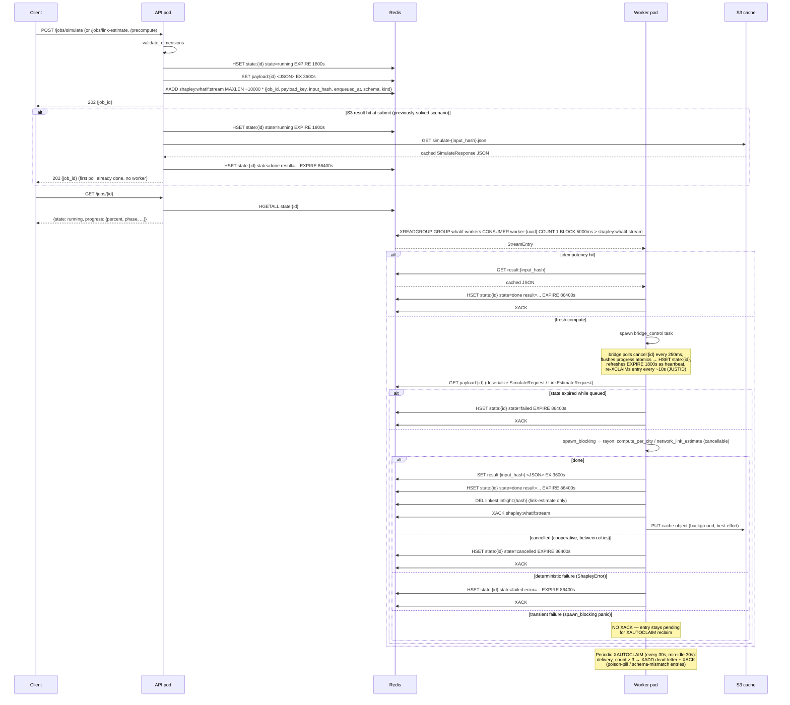

# Shapley Service

HTTP microservice wrapping the `network-shapley` Rust crate: synchronous Shapley value compute with an in-memory + S3 cache, and an async Redis Streams job queue for long-running what-if and link-estimate solves.

---

## Contents

1. [Binary roles](#binary-roles)
2. [Fail-closed auth](#fail-closed-auth)
3. [Endpoints](#endpoints)
4. [Input limits](#input-limits)
5. [Sync request flow](#sync-request-flow)
6. [Async job lifecycle](#async-job-lifecycle)
7. [Redis keyspace](#redis-keyspace)
8. [S3 result cache](#s3-result-cache)
9. [Concurrency model](#concurrency-model)
10. [Container image](#container-image)
11. [Error shape](#error-shape)

---

## Binary roles

One binary, `dz-shapley-service`, serves two roles selected by the first CLI argument or `--role=` flag (`src/main.rs`):

| Role | How to invoke | What runs |
|---|---|---|
| `api` (default) | no arg, `api`, or `--role=api` | Full HTTP server: all sync compute endpoints plus the `/jobs/*` enqueue/poll/cancel surface |
| `worker` | `worker` or `--role=worker` | Minimal `/health`-only HTTP listener plus the Redis Stream consume loop |

Both roles share the same `AppState` (in-memory epoch cache, S3 cache handle, API token, job store) and the same graceful-shutdown handler. SIGTERM or Ctrl-C stops the server; an in-flight worker solve winds down within the `terminationGracePeriod`, and any interrupted entry is recovered by the worker's `XAUTOCLAIM` sweep under at-least-once delivery.

The split is described in [ADR 0001](adr/0001-async-compute-queue.md): heavy compute must run on workers, not on API replicas.

---

## Fail-closed auth

Compute endpoints are gated at startup, not per-request, by the logic in `src/main.rs`:

- **Token set** (`SHAPLEY_API_TOKEN` non-empty): compute endpoints are mounted and protected by the `require_auth` middleware — `Authorization: Bearer <token>` required. Bearer comparison uses a constant-time XOR-accumulate (`ct_eq`) over equal-length tokens to avoid timing leaks; a length mismatch returns early, which reveals only the token's length, never its content.
- **No token + `SHAPLEY_ALLOW_UNAUTHENTICATED=1`**: compute endpoints are mounted unauthenticated. Intended for local dev only; the service logs a warning.
- **No token + flag absent**: compute endpoints are **not mounted at all** — only `/health` is served. An operator cannot accidentally expose an open solver by omitting the token; they must explicitly opt in.

CORS is GET + POST only. If `CORS_ORIGIN` is set, that single origin is allowed; if unset, no cross-origin requests are permitted (same-origin only). The frontend reaches the service through a server-side proxy, so CORS policy does not affect it.

---

## Endpoints

All compute endpoints require auth (see above). `/health` is always open.

| Method | Path | Auth | Purpose | Notable limits |
|---|---|---|---|---|
| `GET` | `/health` | None | Liveness probe; returns `{status, service, version}` | — |
| `POST` | `/shapley` | Required | Synchronous per-city exact Shapley values for an epoch input; reads from in-memory / S3 cache, computes on miss | Body ≤ 2 MB, timeout 120 s |
| `POST` | `/simulate` | Required | Synchronous what-if: baseline + modified Shapley in one shot, reusing unchanged source cities from the cache | Body ≤ 2 MB, timeout 120 s |
| `POST` | `/link-estimate` | Required | Synchronous per-link value-add (retag-Shapley) for a focus operator; S3 read-through; 422 if focus owns > 12 links | Body ≤ 2 MB, timeout 120 s |
| `POST` | `/precompute` | Required | Enqueue a `JobKind::Baseline` job; short-circuits with `200 already-cached` on a cache hit; `503` if Redis is absent | — |
| `POST` | `/jobs/simulate` | Required | Enqueue a what-if simulation; returns `202 {job_id}` | — |
| `POST` | `/jobs/link-estimate` | Required | Enqueue a per-link value-add; in-flight dedup via `SET NX`; S3 short-circuit at submit time; returns `202 {job_id}` | — |
| `GET` | `/jobs/{id}` | Required | Poll job state, progress, and result | — |
| `DELETE` | `/jobs/{id}` | Required | Request cooperative cancellation; `202 {state: cancelling}` or `404` | — |
| `POST` | `/precompute/link-estimates` | Required | Enqueue a sweep job that fans out one link-estimate child per operator (epoch-cron warm-up); returns `202 {job_id}` | — |
| `GET` | `/precompute/link-estimates/status` | Required | Check whether the S3 "fully swept" marker exists for `?tag=`; the cron route uses this to skip the snapshot build on a warm epoch | — |

Router source: `src/main.rs` (`run_api`) and route handlers in `src/routes.rs`.

---

## Input limits

Verified from `src/routes.rs`:

| Limit | Value | Where enforced |
|---|---|---|
| `MAX_DEVICES` | 500 | `validate_dimensions` |
| `MAX_LINKS` (private and public, each) | 2,000 | `validate_dimensions` |
| `MAX_DEMANDS` | 2,000 | `validate_dimensions` |
| `MAX_OPERATORS` | 20 | `validate_dimensions` — coalition LP cost is 2^N; the exact solver is infeasible past ~20 |
| Sync `/link-estimate` focus cap (`SYNC_MAX_FOCUS_LINKS`) | 12 | `link_estimate` handler — 12 focus links → 2^13 = 8,192 LPs, the most that fits the 120 s timeout; above this returns 422 with a pointer to `/jobs/link-estimate` |
| Sweep / async focus cap (`SWEEP_MAX_FOCUS_LINKS`) | 19 | `run_sweep` in `src/worker.rs` — players = links + "Others"; 19 + 1 = 20 = the engine's exact-solve ceiling; 20+ links are reported in the sweep summary's `skipped` list, never enqueued |
| Request body limit | 2 MB | `DefaultBodyLimit::max(2 * 1024 * 1024)` in `src/main.rs` |
| Request timeout | 120 s | `TimeoutLayer::new(Duration::from_secs(120))` in `src/main.rs` |

---

## Sync request flow

`POST /shapley` (the other sync endpoints follow the same cache pattern):

1. **Validate** input dimensions with `validate_dimensions`; return 400 on violation.
2. **Hash** the input via `cache::hash_input` (JSON-serialized, `DefaultHasher`).
3. **In-memory read**: acquire a read lock on the `RwLock<Option<EpochCache>>` in `AppState.epoch_cache`; return the cached `ShapleyResponse` if the hash matches.
4. **S3 read-through**: on an in-memory miss, call `S3Cache::load`; on hit, rehydrate the in-memory cache under a write lock and return.
5. **Cold path** (`compute_and_store_baseline`): dispatch the per-city EXACT solve via `tokio::task::spawn_blocking` onto the rayon pool. Cities are solved sequentially (see [Concurrency model](#concurrency-model)).
6. **Store**: under a write lock, update the in-memory `EpochCache` with the fresh per-city values and aggregated baseline. Then detach a `tokio::spawn` to persist the cache object to S3 (best-effort; the response is already returned).

---

## Async job lifecycle



Keys in the diagram are shown without their `shapley:whatif:` / `shapley:linkest:` prefixes for readability — the full patterns are in the [Redis keyspace](#redis-keyspace) table.

**Schema versioning and mixed-version rollouts**: every stream entry carries a `schema` field (`whatif/v1`, `linkest/v1`, `sweep/v1`, `baseline/v1`, defined in `src/queue.rs`). A worker that reads an entry with an unrecognized schema dead-letters it immediately instead of mis-decoding a newer payload. This makes rolling deploys safe: old workers silently pass unknown-kind entries to the dead-letter stream while new workers drain the backlog, and the schema version is the only gate — there is no per-kind fallback behavior.

---

## Redis keyspace

Source of truth: the **constants** in `src/queue.rs` and `src/jobs.rs` (`JOB_TTL_SECS` for running states and `TERMINAL_TTL_SECS` for terminal states); the table below reflects the code.

| Key pattern | Type | TTL | Purpose |
|---|---|---|---|
| `shapley:whatif:stream` | Stream | — | Work queue; `XADD MAXLEN ~10000`; consumer group `whatif-workers` |
| `shapley:whatif:dead` | Stream | — | Dead-letter; poison entries (schema mismatch or delivery count > 3) |
| `shapley:whatif:payload:{job_id}` | String | 3600 s (sweep payloads: 86400 s) | Serialized request body (store-and-reference; never inlined into the stream). Sweep payloads use a 24 h TTL and are refreshed by the worker on every child pickup so a deep queue cannot outlast the payload. |
| `shapley:whatif:result:{hash}` | String | 3600 s | Idempotency cache keyed by the whole-request payload hash (hex); prevents recompute on redelivery |
| `shapley:whatif:state:{job_id}` | Hash | 1800 s (running) · 86400 s (terminal) | Fields: `state`, `coalitions_solved`, `samples_done`, `max_samples`, `batch_samples`, `batch_total`, `batch_solved`, `phase`, `result` (done), `error` (failed). Running state TTL is heartbeat-refreshed. Terminal states (done/failed/cancelled) expire at 86400 s so completed results stay pollable for 24 h (PSYS-557); for longer-lived retrieval, load from the S3 result store (see below). |
| `shapley:whatif:cancel:{job_id}` | String | 1800 s | Cancel flag (`"1"`); a separate key so progress flushes can never clobber a concurrent cancel (ADR C4 note in `src/queue.rs`); only meaningful while a job is running |
| `shapley:linkest:inflight:{hash}` | String | 86400 s | In-flight dedup claim for link-estimate solves; `SET NX EX`; cleared by the worker on terminal states; TTL is a crash backstop only |
| `shapley/v3/simulate-{hash}.json` (S3) | JSON | — | Cached simulate result, persisted forever by input hash (hex). Re-running any previously-solved scenario completes at submit time (PSYS-557). Keyed by the whole-request payload hash, identical to the queue entry's `input_hash`. An optional out-of-repo S3 lifecycle rule can expire old results. |

**Stream entry fields** (flat key/value pairs on the stream entry, defined in `src/queue.rs` `field` module):

| Field | Required | Value |
|---|---|---|
| `job_id` | Yes | UUIDv4 minted by the API pod |
| `payload_key` | Yes | `shapley:whatif:payload:{job_id}` (or the parent sweep's shared key for sweep children) |
| `input_hash` | Yes | Hex-encoded u64 hash of the payload JSON |
| `enqueued_at` | Yes | Unix epoch milliseconds |
| `schema` | Yes | Schema version tag (see table below) |
| `kind` | No (defaults to `simulate`) | `simulate`, `link-estimate`, `sweep`, or `baseline` |
| `focus` | No | Operator name; present only on sweep-spawned link-estimate children |

**Schema version tags** (from `src/queue.rs`):

| Tag | Constant | Job kind |
|---|---|---|
| `whatif/v1` | `ENTRY_SCHEMA` | `simulate` (what-if) |
| `linkest/v1` | `LINKEST_SCHEMA` | `link-estimate` |
| `sweep/v1` | `SWEEP_SCHEMA` | `sweep` (epoch fan-out) |
| `baseline/v1` | `BASELINE_SCHEMA` | `baseline` (precompute) |

A separate tag per kind means an older worker that does not recognize `linkest/v1` dead-letters the entry (with an accurate "unsupported job schema" error) rather than burning `MAX_DELIVERIES` blind retries on a mis-decoded payload.

**Consumer group mechanics**: the group `whatif-workers` is created idempotently at worker startup (`XGROUP CREATE … $ MKSTREAM`; `BUSYGROUP` is expected and ignored). Each worker instance uses a unique consumer name `worker-{uuid}`. The bridge task re-`XCLAIM`s its own in-flight entry every ~10 s (`JUSTID`, which does not increment the delivery counter) so the `XAUTOCLAIM` sweep (min-idle 30 s) cannot mistake a live solve for an abandoned entry.

---

## S3 result cache

Source: `src/cache.rs`. Activated by setting `S3_CACHE_BUCKET`; a no-op without it.

When `S3_CACHE_ENDPOINT` is set, the AWS SDK client is configured with that URL and `force_path_style(true)` for compatibility with S3-compatible object gateways (e.g. a self-hosted object gateway). Credentials come from the standard `AWS_ACCESS_KEY_ID` / `AWS_SECRET_ACCESS_KEY` environment variables via the default credential chain; no STS or cloud metadata endpoint is required.

**S3 object key patterns** (all under the `v3` engine-version prefix, verified in `src/cache.rs`):

| Pattern | Example | Contents |
|---|---|---|
| `shapley/v3/cache-{hash:016x}.bin` | `shapley/v3/cache-0000abcd1234ef56.bin` | bincode-serialized `EpochCache` (per-city Shapley values + aggregated baseline) |
| `shapley/v3/link-estimate-{hash:016x}.bin` | `shapley/v3/link-estimate-0000abcd1234ef56.bin` | bincode-serialized `LinkEstimateResponse` |
| `shapley/v3/simulate-{hash:016x}.json` | `shapley/v3/simulate-0000abcd1234ef56.json` | JSON-serialized `SimulateResponse` (what-if result, persisted forever by whole-request payload hash; PSYS-557) |
| `shapley/v3/sweep-marker-{hash:016x}.json` | `shapley/v3/sweep-marker-0000abcd1234ef56.json` | JSON `{"tag": "..."}` marker indicating a fully swept epoch; tag is hashed before use as the key suffix |

The `v3` prefix must be bumped on any change to the serialized shape or the engine that produced the values, so results from an older engine are never served for the same input hash.

Writes are always detached best-effort (`tokio::spawn` or fire-and-forget calls in `src/routes.rs` and `src/worker.rs`). Without S3, the service is stateless across restarts (cold start on every pod recycle); the precompute cron mitigates this by warming the cache before the first client request of an epoch.

---

## Concurrency model

- All HTTP handlers run on the tokio multi-thread runtime (`#[tokio::main]`).
- Heavy LP solves are dispatched via `tokio::task::spawn_blocking`, which places them on a dedicated blocking thread pool and avoids starving the async executor.
- The HiGHS LP solver is parallelized internally using rayon. Each coalition in the 2^N exact solve runs as a rayon parallel task.
- **Cities are solved sequentially**, not with `par_iter` over the city loop. The rationale is documented in `src/routes.rs` (`compute_per_city`): the engine's warm-start solver state is per-rayon-worker and keyed by a problem epoch. Running cities in parallel would nest the city loop over the engine's coalition `par_iter`; a rayon worker stealing coalitions across cities would have to rebuild its full HiGHS LP model on every city boundary — negating the warm-start benefit and, with full-size models, potentially making parallel cities slower than sequential. Sequential cities let each city's coalition loop own the full rayon pool with a warm model; the only cross-city cost is one model rebuild per worker at each city boundary, which is negligible.
- The link-estimate solve is a single coalition loop (no outer city loop), so it satisfies the same warm-start contract.
- The cancel flag in `ComputeControl` is an atomic bool checked between cities (or within the engine's coalition loop for the engine-cancellable variant), bounding cancel latency to at most one city's solve time.

---

## Container image

Source: `services/shapley-rs/Dockerfile` and `services/shapley-rs/Cargo.toml`.

**Build stages**:

1. **Builder** — `rustlang/rust:nightly-slim` (nightly required for edition 2024 let-chains). Installs `cmake`, `clang`, `libclang-dev`, and `build-essential` to compile HiGHS C++ from source (the `highs-sys` crate) and generate FFI bindings via bindgen. Also installs `pkg-config`, `libssl-dev`, and `ca-certificates` for the AWS SDK's TLS. Dependency layer is cached separately from source for faster rebuilds.

2. **Runtime** — `debian:trixie-slim`. Trixie is required (not bookworm) because the binary dynamically links `libstdc++` (HiGHS C++) and needs GLIBC 2.39 and CXXABI 1.3.15 from the builder's toolchain. Adds `libstdc++6` and `libgcc-s1`.

**Non-root user**: a non-root `shapley` user is created (primary group `shapley`), and the `/app` directory is `chown`'d `shapley:0` — group 0 — with `chmod g=u`. This is the standard OpenShift-compatible random-UID pattern: such platforms inject a random non-root UID (group 0) at runtime, and giving group 0 the same permissions as the owner ensures the binary stays accessible regardless of which UID is injected.

**Entrypoint**: `["/app/dz-shapley-service"]`; the container `args` field passes `api` or `worker` to select the role.

**Release profile** (from `Cargo.toml`):

```toml
[profile.release]
lto = true
codegen-units = 1
strip = true
```

LTO and single codegen unit for maximum optimization; `strip = true` removes debug symbols from the released binary.

---

## Error shape

All error responses use a consistent JSON body with no stack traces:

```json
{ "error": "human-readable message" }
```

HTTP status codes follow standard conventions: 400 for validation failures, 422 for input-deterministic compute errors (e.g. operator count exceeds the exact-solve cap, sync link-estimate focus cap exceeded), 404 for unknown jobs, 503 when Redis is absent and the requested endpoint requires it, and 500 for infrastructure errors.

---

## See also

- [README](../README.md) — project index
- [architecture.md](architecture.md) — system-level component map
- [data-sources.md](data-sources.md) — upstream data inputs
- [shapley-pipeline.md](shapley-pipeline.md) — algorithm semantics (per-city LP, stake-weighted aggregation)
- [development.md](development.md) — local setup, running the service
- [operations.md](operations.md) — environment variable reference, deployment topology
- [ADR 0001](adr/0001-async-compute-queue.md) — rationale for the async compute queue
