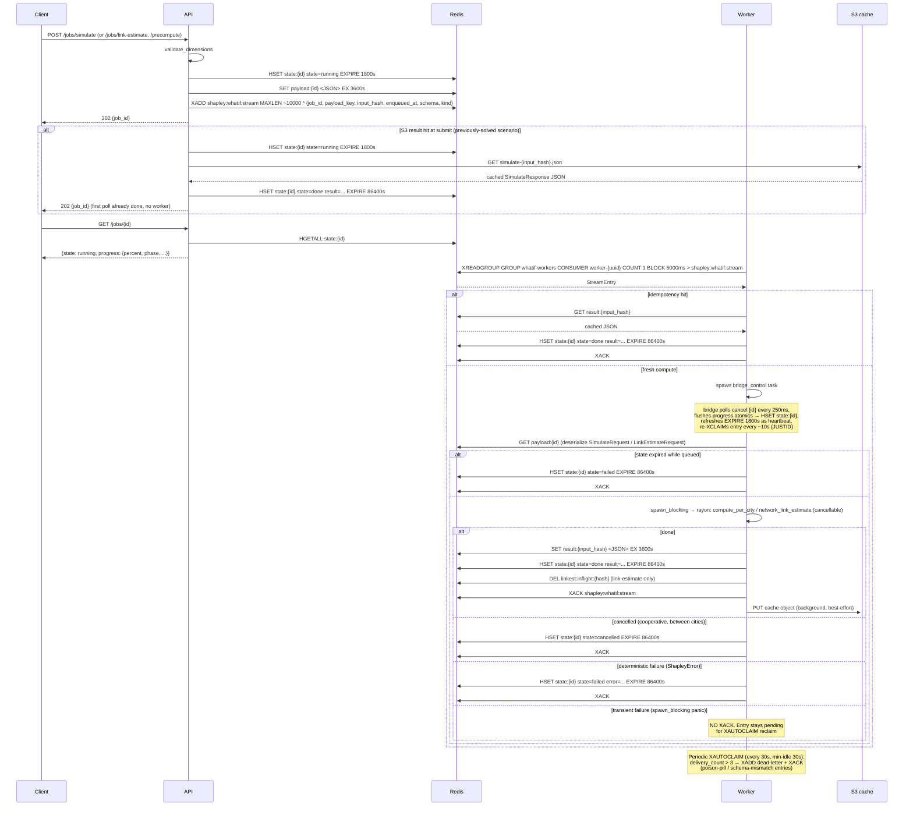

# Shapley Service

HTTP microservice wrapping the `network-shapley` Rust crate. It does four jobs: synchronous Shapley compute over an in-memory and S3 cache, an async Redis Streams job queue for long what-if and link-estimate solves, ingest-gated publication of per-epoch baseline aliases and sweep markers, and the per-epoch diff index behind the changelog. It reads no public snapshot bucket; the Next.js cron pushes everything epoch-specific to it.

---

## Contents

1. [Binary roles](#binary-roles)
2. [Fail-closed auth](#fail-closed-auth)
3. [Endpoints](#endpoints)
4. [Input limits](#input-limits)
5. [Sync request flow](#sync-request-flow)
6. [Async job lifecycle](#async-job-lifecycle)
7. [Redis keyspace](#redis-keyspace)
8. [S3 result cache](#s3-result-cache)
9. [Snapshot diff index](#snapshot-diff-index)
10. [Concurrency model](#concurrency-model)
11. [Container image](#container-image)
12. [Error shape](#error-shape)

---

## Binary roles

One binary, `dz-shapley-service`, serves two roles selected by the first CLI argument or `--role=` flag (`src/main.rs`):

| Role | How to invoke | What runs |
|---|---|---|
| `api` (default) | no arg, `api`, or `--role=api` | Full HTTP server: all sync compute endpoints plus the `/jobs/*` enqueue/poll/cancel surface |
| `worker` | `worker` or `--role=worker` | Minimal `/health`-only HTTP listener plus the Redis Stream consume loop |

Both roles share the same `AppState` (in-memory epoch cache, S3 cache handle, API token, job store) and the same graceful-shutdown handler. SIGTERM or Ctrl-C stops the server; an in-flight worker solve winds down within the platform's shutdown grace period, and any interrupted entry is recovered by the worker's `XAUTOCLAIM` sweep under at-least-once delivery.

The split exists so heavy compute runs on workers rather than on API replicas.

---

## Fail-closed auth

Compute endpoints are gated at startup, not per-request, by the logic in `src/main.rs`:

- **Token set** (`SHAPLEY_API_TOKEN` non-empty): compute endpoints are mounted and protected by the `require_auth` middleware: `Authorization: Bearer <token>` required. Bearer comparison uses a constant-time XOR-accumulate (`ct_eq`) over equal-length tokens to avoid timing leaks; a length mismatch returns early, which reveals only the token's length, never its content.
- **No token + `SHAPLEY_ALLOW_UNAUTHENTICATED=1`**: compute endpoints are mounted unauthenticated. Intended for local dev only; the service logs a warning.
- **No token + flag absent**: compute endpoints are **not mounted at all**. Only `/health` is served. An operator cannot accidentally expose an open solver by omitting the token; they must explicitly opt in.

A second token guards the write routes. `SHAPLEY_INGEST_TOKEN` is checked as the `X-Ingest-Token` header on `POST /precompute/link-estimates`, `POST /precompute/baseline`, and `PUT /diff/shape/:epoch`, on top of the compute bearer. It fails closed in the other direction from the compute token: when it is unset those routes answer `503 {"error":"ingest not configured"}` rather than opening. Only the cron holds it, so a compute token alone cannot publish an alias for any tag.

CORS is GET + POST only. If `CORS_ORIGIN` is set, that single origin is allowed; if unset, no cross-origin requests are permitted (same-origin only). The frontend reaches the service through a server-side proxy, so CORS policy does not affect it.

---

## Endpoints

All compute endpoints require auth (see above). `/health` is always open.

| Method | Path | Auth | Purpose | Notable limits |
|---|---|---|---|---|
| `GET` | `/health` | None | Liveness probe; returns `{status, service, version}` | — |
| `POST` | `/shapley` | Required | Synchronous per-city exact Shapley values for an epoch input; reads from in-memory / S3 cache, computes on miss. Concurrent cold requests for one input hash share a single in-process solve (`src/inflight.rs`) | Body ≤ 2 MB, timeout 120 s |
| `POST` | `/simulate` | Required | Synchronous what-if: baseline + modified Shapley in one shot, reusing unchanged source cities from the cache | Body ≤ 2 MB, timeout 120 s |
| `POST` | `/link-estimate` | Required | Synchronous per-link value-add (retag-Shapley) for a focus operator; S3 read-through before the cap check; 422 if focus owns > 12 links. Solves on a scoped rayon pool and is cancelled when the client disconnects | Body ≤ 2 MB, timeout 120 s |
| `GET` | `/shapley/baseline?tag=` | Required | Cache-only read of the baseline published for `tag`: `200` with the alias body (`method`, `operator_count`, `values`, `tag`, `input_hash`), `404 {status:"not-cached", tag}` on a miss or with no S3, `400` for an empty, oversized, or NUL-bearing tag, `502` when the store fails or the read bound elapses. It never computes and never enqueues | tag ≤ 256 bytes, one S3 GET bounded at 8 s |
| `POST` | `/precompute` | Required | Enqueue a `JobKind::Baseline` job; short-circuits with `200 already-cached` on a cache hit; `503` if Redis is absent | 202 body `{status: "accepted", job_id, input_hash}`; poll with `GET /jobs/{id}` |
| `POST` | `/precompute/baseline` | Compute + ingest | Body `{input, tag}`. Answers `200 already-cached` only when an alias for `tag` names this input's hash; otherwise enqueues a `baseline-publish` job whose worker loads or solves the baseline, persists it, then writes the alias. `503` without S3 or Redis | tag ≤ 256 bytes; 202 body `{status:"accepted", job_id, input_hash, tag}` |
| `POST` | `/jobs/simulate` | Required | Enqueue a what-if simulation; returns `202 {job_id}` | — |
| `POST` | `/jobs/link-estimate` | Required | Enqueue a per-link value-add; in-flight dedup via `SET NX` (an attach returns the running job's id); S3 short-circuit at submit time; returns `202 {job_id}` | 422 if focus owns more than 19 links (`SWEEP_MAX_FOCUS_LINKS`) |
| `POST` | `/jobs/link-estimate/by-tag` | Required | Body `{tag, operator_focus}`. Completes a job straight from the published link-estimate alias, so the caller needs no solver input and no snapshot. `404` when no alias exists or it dangles, `502` on an alias-read failure, `503` without Redis. The Next.js link-value route tries this first | tag ≤ 256 bytes |
| `GET` | `/jobs/{id}` | Required | Poll job state, progress, and result; see [Job status body](#job-status-body) | — |
| `DELETE` | `/jobs/{id}` | Required | Request cooperative cancellation; `202 {state: cancelling}` or `404` | — |
| `POST` | `/precompute/link-estimates` | Required | Enqueue a sweep job that fans out one link-estimate child per operator (epoch-cron warm-up); returns `202 {job_id}` | Sweep status is the job result at `GET /jobs/{id}` |
| `GET` | `/precompute/link-estimates/status` | Required | Check whether the S3 "fully swept" marker exists for `?tag=`; the cron route uses this to skip the snapshot build on a warm epoch | — |
| `GET` | `/diff?from&to` | Required | Network topology diff between two epochs: summary, per-contributor rollup, and the `added`, `removed`, and `changed` links with first-observed attribution. Served from the diff index | `from` and `to` each in `[48, 100000]`, `from != to`, `abs(to - from) <= 200`. Order is not enforced, so `from > to` gives a backward diff |
| `GET` | `/diff/contributor/{code}?from&to` | Required | One contributor's diff: footprint before and after, plus added, removed, and changed links. No display `name`; the Next.js proxy adds it | Same window rules |
| `GET` | `/diff/missing?latest=N&depth=D` | Required | `{missing: [epoch…]}` over `[max(latest-depth+1, 48), latest]`, probing durable records directly so a corrupt body counts as missing. This is the cron's repair discovery | `depth` default 31, max 200; ≤ 8 concurrent reads, 2 s each, 10 s overall |
| `PUT` | `/diff/shape/{epoch}` | Compute + ingest | Accept one epoch's `DiffShape` from the cron. `201` created, `409` when a readable record already exists, `400` malformed, `422` invalid shape, `502` store failure, `503` without durable persistence | ≤ 10,000 links, ≤ 1,000 contributors, body epoch must equal path epoch, ≤ 2 MB persisted |

Router source: `src/main.rs` (`run_api`) and route handlers in `src/routes.rs`.

---

## Input limits

Verified from `src/routes.rs`:

| Limit | Value | Where enforced |
|---|---|---|
| `MAX_DEVICES` | 500 | `validate_dimensions` |
| `MAX_LINKS` (private and public, each) | 2,000 | `validate_dimensions` |
| `MAX_DEMANDS` | 2,000 | `validate_dimensions` |
| `MAX_OPERATORS` | 20 at full uptime, 15 (`MAX_OPERATORS_PARTIAL_UPTIME`) when `operator_uptime < 1.0` (production uses 0.98) | `check_operator_limit` inside the engine (`network-shapley-rs/src/validation.rs`), not the service's `validate_dimensions`. Coalition LP cost is 2^N; link estimation is exempt (see `MAX_LINK_PLAYERS` below) |
| Sync `/link-estimate` focus cap (`SYNC_MAX_FOCUS_LINKS`) | 12 | `link_estimate` handler. 12 focus links is 13 players, 2^13 = 8,192 coalitions, about 30 minutes at the production rate of ~218 ms/coalition on 4 solver threads; above this returns 422 with a pointer to `/jobs/link-estimate` |
| Sweep / async focus cap (`SWEEP_MAX_FOCUS_LINKS`) | 19 | `run_sweep` in `src/worker.rs` (skip) and `link_estimate_start` in `src/routes.rs` (422). Players = links + "Others"; 19 links is 20 players, 2^20 ≈ 1.05M coalitions, about 63 hours at ~218 ms/coalition; 18 links is about 32 hours; both outlast an epoch, so links above 19 are reported in the sweep summary's `skipped` list, never enqueued |
| Link-estimate player cap (`MAX_LINK_PLAYERS`) | 31 | `network_link_estimate` inside the engine (`network-shapley-rs/src/link_estimate.rs`). Coalition membership is a `u32` bitmask; bit 31 is a reserved sentinel, so players occupy bits 0-30 |
| Request body limit | 2 MB | `DefaultBodyLimit::max(2 * 1024 * 1024)` in `src/main.rs` |
| Request timeout | 120 s | `TimeoutLayer::new(Duration::from_secs(120))` in `src/main.rs` |
| Tag length (`MAX_TAG_BYTES`) | 256 bytes, no NUL | `/shapley/baseline`, `/precompute/baseline`, and `/jobs/link-estimate/by-tag` |
| Baseline probe bound (`BASELINE_PROBE_TIMEOUT`) | 8 s | `GET /shapley/baseline`, one S3 GET; `502` when it elapses |
| Diff shape ingest | 10,000 links, 1,000 contributors, 2 MB persisted; duplicate pubkeys and duplicate contributor codes rejected | `PUT /diff/shape/{epoch}` in `src/diff_routes.rs` and `src/diff_store.rs` |
| Diff read budget | 18 s per request, 8 s per window end, 6 s per intermediate, 10 concurrent intermediates | `src/diff_routes.rs` |

---

## Sync request flow

`POST /shapley` (the other sync endpoints follow the same cache pattern):

1. **Validate** input dimensions with `validate_dimensions`; return 400 on violation.
2. **Hash** the input via `cache::hash_input` (JSON-serialized, `DefaultHasher`).
3. **In-memory read**: acquire a read lock on the `RwLock<Option<EpochCache>>` in `AppState.epoch_cache`; return the cached `ShapleyResponse` if the hash matches.
4. **S3 read-through**: on an in-memory miss, call `S3Cache::load`; on hit, rehydrate the in-memory cache under a write lock and return.
5. **Cold path** (`compute_and_store_baseline`): dispatch the per-city EXACT solve via `tokio::task::spawn_blocking` onto the rayon pool. Cities are solved sequentially (see [Concurrency model](#concurrency-model)).
6. **Store**: under a write lock, update the in-memory `EpochCache` with the fresh per-city values and aggregated baseline. Then detach a `tokio::spawn` to persist the cache object to S3 (best-effort; the response is already returned).

---

## Async job lifecycle


```mermaid
sequenceDiagram
    participant C as Client
    participant A as API
    participant R as Redis
    participant W as Worker
    participant S3 as S3 cache

    C->>A: POST /jobs/simulate (or /jobs/link-estimate, /precompute)
    A->>A: validate_dimensions
    A->>R: HSET state:{id} state=running  EXPIRE 1800s
    A->>R: SET payload:{id} <JSON>  EX 3600s
    A->>R: XADD shapley:whatif:stream MAXLEN ~10000 * {job_id, payload_key, input_hash, enqueued_at, schema, kind}
    A-->>C: 202 {job_id}

    alt S3 result hit at submit (previously-solved scenario)
        A->>R: HSET state:{id} state=running  EXPIRE 1800s
        A->>S3: GET simulate-{input_hash}.json
        S3-->>A: cached SimulateResponse JSON
        A->>R: HSET state:{id} state=done result=...  EXPIRE 86400s
        A-->>C: 202 {job_id}  (first poll already done, no worker)
    end

    C->>A: GET /jobs/{id}
    A->>R: HGETALL state:{id}
    A-->>C: {state: running, progress: {percent, phase, ...}}

    W->>R: XREADGROUP GROUP whatif-workers CONSUMER worker-{uuid} COUNT 1 BLOCK 5000ms > shapley:whatif:stream
    R-->>W: StreamEntry

    alt idempotency hit
        W->>R: GET result:{input_hash}
        R-->>W: cached JSON
        W->>R: HSET state:{id} state=done result=...  EXPIRE 86400s
        W->>R: XACK
    else fresh compute
        W->>W: spawn bridge_control task
        Note over W: bridge polls cancel:{id} every 250ms,<br/>flushes progress atomics → HSET state:{id},<br/>refreshes EXPIRE 1800s as heartbeat,<br/>re-XCLAIMs entry every ~10s (JUSTID)

        W->>R: GET payload:{id}  (deserialize SimulateRequest / LinkEstimateRequest)

        alt state expired while queued
            W->>R: HSET state:{id} state=failed  EXPIRE 86400s
            W->>R: XACK
        else
            W->>W: spawn_blocking → rayon: compute_per_city / network_link_estimate (cancellable)

            alt done
                W->>R: SET result:{input_hash} <JSON>  EX 3600s
                W->>R: HSET state:{id} state=done result=...  EXPIRE 86400s
                W->>R: DEL linkest:inflight:{hash}  (link-estimate only)
                W->>R: XACK shapley:whatif:stream
                W->>+S3: PUT cache object (background, best-effort)
            else cancelled (cooperative, between cities)
                W->>R: HSET state:{id} state=cancelled  EXPIRE 86400s
                W->>R: XACK
            else deterministic failure (ShapleyError)
                W->>R: HSET state:{id} state=failed error=...  EXPIRE 86400s
                W->>R: XACK
            else transient failure (spawn_blocking panic)
                Note over W: NO XACK. Entry stays pending<br/>for XAUTOCLAIM reclaim
            end
        end
    end

    Note over W: Periodic XAUTOCLAIM (every 30s, min-idle 30s):<br/>delivery_count > 3 → XADD dead-letter + XACK<br/>(poison-pill / schema-mismatch entries)
```

Keys in the diagram are shown without their `shapley:whatif:` / `shapley:linkest:` prefixes for readability. The full patterns are in the [Redis keyspace](#redis-keyspace) table.

### Job status body

`GET /jobs/{id}` returns a body shaped by `state` (`jobs.rs` `snapshot`):

| `state` | Body |
|---|---|
| `running` | `{state, progress: {phase, coalitions_solved, coalitions_total, samples_done, max_samples, batch_samples, batch_total, batch_solved, percent}}` |
| `done` | `{state, progress: {percent: 100}, result}` |
| `failed` | `{state, error}` |
| `cancelled` | `{state}` |

`percent` is not stored. `snapshot` derives it at read time from `samples_done`, `max_samples`, and the in-flight batch counters (`running_percent`), and it ranges 0-99 while running. `phase` is one of `baseline`, `modified`, or `link-estimate`. A what-if job resets its counters and relabels `phase` at the baseline-to-modified handoff (`control.progress.reset()` in `src/worker.rs`), so the modified phase's bar starts at 0 again. The baseline phase is usually a cache hit, so it normally finishes in under a second.

**Schema versioning and mixed-version rollouts**: every stream entry carries a `schema` field (`whatif/v1`, `linkest/v1`, `sweep/v1`, `baseline/v1`, defined in `src/queue.rs`). A worker that reads an entry with an unrecognized schema dead-letters it immediately instead of mis-decoding a newer payload. This makes rolling deploys safe: old workers silently pass unknown-kind entries to the dead-letter stream while new workers drain the backlog. A redelivered entry dead-letters after more than `MAX_DELIVERIES` (3) deliveries, except a link-estimate entry, which dead-letters after more than `MAX_DELIVERIES_LINK_ESTIMATE` (1) delivery (`src/queue.rs`, applied in `src/worker.rs`).

---

## Redis keyspace

Source of truth: the **constants** in `src/queue.rs` and `src/jobs.rs` (`JOB_TTL_SECS` for running states and `TERMINAL_TTL_SECS` for terminal states); the table below matches the code.

| Key pattern | Type | TTL | Purpose |
|---|---|---|---|
| `shapley:whatif:stream` | Stream | — | Work queue; `XADD MAXLEN ~10000`; consumer group `whatif-workers` |
| `shapley:whatif:dead` | Stream | — | Dead-letter: poison entries, meaning a schema mismatch or a delivery count over `MAX_DELIVERIES` = 3. Link-estimate entries dead-letter after `MAX_DELIVERIES_LINK_ESTIMATE` = 1 delivery, because an OOM-killed breakdown would re-kill every worker it lands on |
| `shapley:whatif:payload:{job_id}` | String | 3600 s (sweep payloads: 86400 s) | Serialized request body (store-and-reference; never inlined into the stream). Sweep payloads use a 24 h TTL and are refreshed by the worker on every child pickup so a deep queue cannot outlast the payload. |
| `shapley:whatif:result:{hash}` | String | 3600 s | Idempotency cache keyed by the whole-request payload hash (hex); prevents recompute on redelivery |
| `shapley:whatif:state:{job_id}` | Hash | 1800 s (running) · 86400 s (terminal) | Fields: `state`, `coalitions_solved`, `samples_done`, `max_samples`, `batch_samples`, `batch_total`, `batch_solved`, `phase`, `result` (done), `error` (failed). Running state TTL is heartbeat-refreshed. Terminal states (done/failed/cancelled) expire at 86400 s so completed results stay pollable for 24 h; for longer-lived retrieval, load from the S3 result store (see below). |
| `shapley:whatif:cancel:{job_id}` | String | 1800 s | Cancel flag (`"1"`); a separate key so progress flushes can never clobber a concurrent cancel (ADR C4 note in `src/queue.rs`); only meaningful while a job is running |
| `shapley:linkest:inflight:{hash}` | String | 86400 s | In-flight dedup claim for link-estimate solves; `SET NX EX`; cleared by the worker on terminal states; TTL is a crash backstop only |
| `shapley/v3/simulate-{hash}.json` (S3) | JSON | — | Cached simulate result, persisted forever by input hash (hex). Re-running any previously-solved scenario completes at submit time. Keyed by the whole-request payload hash, identical to the queue entry's `input_hash`. An optional out-of-repo S3 lifecycle rule can expire old results. |

**Stream entry fields** (flat key/value pairs on the stream entry, defined in `src/queue.rs` `field` module):

| Field | Required | Value |
|---|---|---|
| `job_id` | Yes | UUIDv4 minted by the API replica |
| `payload_key` | Yes | `shapley:whatif:payload:{job_id}` (or the parent sweep's shared key for sweep children) |
| `input_hash` | Yes | Hex-encoded u64 hash of the payload JSON |
| `enqueued_at` | Yes | Unix epoch milliseconds |
| `schema` | Yes | Schema version tag (see table below) |
| `kind` | No (defaults to `simulate`) | `simulate`, `link-estimate`, `sweep`, or `baseline` |
| `focus` | No | Operator name; present only on sweep-spawned link-estimate children |

**Schema version tags** (from `src/queue.rs`):

| Tag | Constant | Job kind |
|---|---|---|
| `whatif/v1` | `ENTRY_SCHEMA` | `simulate` (what-if) |
| `linkest/v1` | `LINKEST_SCHEMA` | `link-estimate` |
| `sweep/v1` | `SWEEP_SCHEMA` | `sweep` (epoch fan-out) |
| `baseline/v1` | `BASELINE_SCHEMA` | `baseline` (precompute) |
| `baseline-publish/v1` | `BASELINE_PUBLISH_SCHEMA` | `baseline-publish` (tagged precompute, then alias) |

A separate tag per kind means an older worker that does not recognize `linkest/v1` dead-letters the entry (with an accurate "unsupported job schema" error) rather than burning `MAX_DELIVERIES` blind retries on a mis-decoded payload.

**Consumer group mechanics**: the group `whatif-workers` is created idempotently at worker startup (`XGROUP CREATE … $ MKSTREAM`; `BUSYGROUP` is expected and ignored). Each worker instance uses a unique consumer name `worker-{uuid}`. The bridge task re-`XCLAIM`s its own in-flight entry every ~10 s (`JUSTID`, which does not increment the delivery counter) so the `XAUTOCLAIM` sweep (min-idle 30 s) cannot mistake a live solve for an abandoned entry.

---

## S3 result cache

Source: `src/cache.rs`. Activated by setting `S3_CACHE_BUCKET`; a no-op without it.

When `S3_CACHE_ENDPOINT` is set, the AWS SDK client is configured with that URL and `force_path_style(true)` for compatibility with S3-compatible object gateways (e.g. a self-hosted object gateway). Credentials come from the standard `AWS_ACCESS_KEY_ID` / `AWS_SECRET_ACCESS_KEY` environment variables via the default credential chain; no STS or cloud metadata endpoint is required.

One bucket holds three kinds of object: solver results keyed by input hash, the trusted aliases and markers the cron publishes, and the diff index.

| Pattern | Contents |
|---|---|
| `shapley/v3/cache-{hash:016x}.bin` | bincode `EpochCache`: per-city Shapley values plus the aggregated baseline |
| `shapley/v3/link-estimate-{hash:016x}.bin` | bincode `LinkEstimateResponse` |
| `shapley/v3/simulate-{hash:016x}.json` | JSON `SimulateResponse`, kept indefinitely by whole-request payload hash. This is what makes a shared forecast URL return instantly |
| `shapley/v3/publication/v1/baseline-alias-{hash:016x}.json` | JSON `BaselineAlias`: `tag`, `input_hash`, and the `ShapleyResponse` fields. Key hash is `hash_payload("baseline\0" + tag)` |
| `shapley/v3/publication/v1/link-estimate-alias-{hash:016x}.json` | JSON `{"payloadHash": "<16 hex>"}` pointing at a `link-estimate-{hash}.bin`. Key hash is `hash_payload(tag + "\0" + focus)` |
| `shapley/v3/publication/v1/sweep-marker-{hash:016x}.json` | JSON `{"tag": "..."}` marking a fully swept epoch |
| `diff/v1/shape-{epoch:06}.json` | JSON `DiffShape` for one epoch. Its own version prefix; see [Snapshot diff index](#snapshot-diff-index) |

Bump `CACHE_VERSION_PREFIX` (`v3`) on any change to the serialized shape or to the engine that produced the values, so results from an older engine are never served for the same input hash. Hashes come from `std::hash::DefaultHasher` over the canonical JSON, so a Rust toolchain bump can rotate the keyspace at the cost of a recompute. Objects carry no TTL: epoch inputs are immutable and the version prefix is the only staleness guard. Client timeouts are 5 s connect, 20 s read, 30 s per attempt, 90 s per operation.

**Result reads and alias reads differ on failure.** A result read that errors or deserializes badly counts as a miss, and the value is recomputed. An alias read separates a miss (`NoSuchKey`) from a storage failure or a malformed body, and handlers report the latter two as `502`, so "not published" is never confused with "store down". Callers see the generic `alias store unavailable` or `alias is malformed`; the detail stays in logs.

**Publication ordering.** Publication awaits the result object write, then the alias write, so an alias never points at nothing. The baseline path re-puts the result even on a memory hit, because a memory hit does not prove the detached store ever landed.

A worker publishes link-estimate aliases and the sweep marker only for an ingest-authorized sweep whose operator set the service derived (`SweepPayload.derived_operators`, `src/model.rs`). An explicit `operators` list warms the cache and writes no marker, so a partial sweep can never make the cron skip the unswept remainder. The marker also needs every alias write to succeed, so a failed alias withholds it and a later sweep retries from the cached results. Readers accept only aliases and markers under `publication/v1/`.

Ordinary synchronous cache writes stay best-effort: spawned, log-only. Without S3 the service is stateless across restarts, every alias read is a miss, and `PUT /diff/shape` answers 503, so the precompute cron is what warms the cache before the first client request of an epoch.

---

## Snapshot diff index

The changelog and the "recent change digest" card are served from this index, not from snapshot downloads. `src/diff.rs` holds the shape type and the pure diff computations, `src/diff_store.rs` persists them, and `src/diff_routes.rs` serves the requests. The records are immutable per epoch, which is why they are plain objects rather than rows in a database.

A **shape** is the lean projection of one epoch's snapshot: `{epoch, links, contributors}`, camelCase on the wire. A `LinkRef` carries `pubkey`, `contributorCode`, `sideACode`, `sideZCode`, `bandwidthGbps`, and `linkType`; a `ContributorRef` carries `code`, `linkCount`, `deviceCount`, and `metroCount`. About 28 KB per epoch against a 110 MB snapshot. The field names are a shared contract with `lib/types/diff.ts`.

`PUT /diff/shape/:epoch` is the only way a shape enters the store. The service reads no snapshot bucket and runs no scanner or poller; `lib/utils/diff-shape.ts` does the extraction in the Vercel cron, which downloads the snapshot anyway for the Shapley sweep.

Writes are create-only, with one repair path. `DiffStore::put` loads the key first. A readable record answers `409`. A missing key gets `PUT If-None-Match: *`. Bytes proven corrupt get `PUT If-Match: <etag>` using the ETag from their own failed read. A `412` sends the store back to re-read: a readable winner is a conflict, anything else is a lost conditional write. Healthy bytes are never overwritten. Verify these semantics on a new object gateway before deploying against it; [operations.md](operations.md#alias-publication-rollout) has the acceptance test.

Reads check the process cache first, then durable storage. Missing and corrupt both surface as `404`. `latest_epoch` re-lists at most every 5 minutes, and a successful `PUT` advances it at once.

`GET /diff` loads both window ends plus every intermediate epoch, and each added, removed, or changed entry carries `firstObservedEpoch`. Intermediates are optional: a failed or budget-starved one is skipped and counted, and the response then carries `x-diff-degraded: 1`, which the Next.js proxy turns into `no-store` so a degraded answer is never cached. `GET /diff/contributor/{code}` reads only the two ends and compares bandwidth and link type.

---

## Concurrency model

- All HTTP handlers run on the tokio multi-thread runtime (`#[tokio::main]`).
- Heavy LP solves are dispatched via `tokio::task::spawn_blocking`, which places them on a dedicated blocking thread pool and avoids starving the async executor.
- Link-estimate solves, sync and worker alike, run on a scoped rayon pool of `LINK_ESTIMATE_SOLVE_THREADS` threads (default 4, clamped to the machine's parallelism) rather than the global pool. Each rayon worker keeps a resident HiGHS model, and the global default of 16 exhausted a 16 GiB worker.
- Cold `POST /shapley` requests for one input hash are single-flighted per process (`src/inflight.rs`). The leader solves in a detached task, so a dropped request still lands the result; followers await a `watch` channel; a leader panic wakes them with `LeaderGone` instead of wedging them. The table is per process, not per fleet.
- Job concurrency is one job per worker process (`XREADGROUP COUNT 1`), scaled by replica count.
- The HiGHS LP solver is parallelized internally using rayon. Each coalition in the 2^N exact solve runs as a rayon parallel task.
- **Cities are solved sequentially**, not with `par_iter` over the city loop. The rationale is documented in `src/routes.rs` (`compute_per_city`): the engine's warm-start solver state is per-rayon-worker and keyed by a problem epoch. Running cities in parallel would nest the city loop over the engine's coalition `par_iter`; a rayon worker stealing coalitions across cities would have to rebuild its full HiGHS LP model on every city boundary, negating the warm-start benefit and, with full-size models, making parallel cities slower than sequential. Sequential cities let each city's coalition loop own the full rayon pool with a warm model; the only cross-city cost is one model rebuild per worker at each city boundary, which is negligible.
- The link-estimate solve is a single coalition loop (no outer city loop), so it satisfies the same warm-start contract.
- The cancel flag in `ComputeControl` is an atomic bool checked between cities (or within the engine's coalition loop for the engine-cancellable variant), bounding cancel latency to at most one city's solve time.

---

## Container image

Source: `services/shapley-rs/Dockerfile` and `services/shapley-rs/Cargo.toml`.

**Build stages**:

1. **Builder**: `rustlang/rust:nightly-slim` (nightly required for edition 2024 let-chains). Installs `cmake`, `clang`, `libclang-dev`, and `build-essential` to compile HiGHS C++ from source (the `highs-sys` crate) and generate FFI bindings via bindgen. Also installs `pkg-config`, `libssl-dev`, and `ca-certificates` for the AWS SDK's TLS. Dependency layer is cached separately from source for faster rebuilds.

2. **Runtime**: `debian:trixie-slim`. Trixie is required (not bookworm) because the binary dynamically links `libstdc++` (HiGHS C++) and needs GLIBC 2.39 and CXXABI 1.3.15 from the builder's toolchain. Adds `libstdc++6` and `libgcc-s1`.

**Non-root user**: a non-root `shapley` user is created (primary group `shapley`), and the `/app` directory is `chown`'d `shapley:0` (group 0) with `chmod g=u`. This is the standard pattern for platforms that assign a random non-root UID at runtime: giving group 0 the same permissions as the owner keeps the binary accessible regardless of which UID the platform injects.

**Entrypoint**: `["/app/dz-shapley-service"]`; the container `args` field passes `api` or `worker` to select the role.

**Release profile** (from `Cargo.toml`):

```toml
[profile.release]
lto = true
codegen-units = 1
strip = true
```

LTO and single codegen unit for maximum optimization; `strip = true` removes debug symbols from the released binary.

---

## Error shape

All error responses use a consistent JSON body with no stack traces:

```json
{ "error": "human-readable message" }
```

HTTP status codes follow standard conventions: 400 for validation failures, 422 for input-deterministic compute errors (e.g. operator count exceeds the exact-solve cap, sync link-estimate focus cap exceeded), 404 for unknown jobs, 503 when Redis is absent and the requested endpoint requires it, and 500 for infrastructure errors.

---

## See also

- [README](../README.md): project index
- [architecture.md](architecture.md): system-level component map
- [data-sources.md](data-sources.md): upstream data inputs
- [shapley-pipeline.md](shapley-pipeline.md): algorithm semantics (per-city LP, stake-weighted aggregation)
- [development.md](development.md): local setup, running the service
- [operations.md](operations.md): environment variable reference, deployment topology
